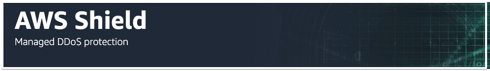

# Cloud Developer 

https://www.udacity.com/course/cloud-developer-nanodegree--nd9990

 

<h2>Content</h2>
<!-- TOC depthfrom:2 depthto:4 orderedlist:false -->

- [Intro](#intro)
- [Cloud Fundamentals](#cloud-fundamentals)
    - [Cloud Computing](#cloud-computing)
    - [Foundational & Compute Service](#foundational--compute-service)
        - [EC2: Elastic Cloud Compute](#ec2-elastic-cloud-compute)
        - [EBS: Elastic Block Store](#ebs-elastic-block-store)
        - [VPC: Virtual Private Cloud](#vpc-virtual-private-cloud)
        - [Lab - Launch an EC2 instance](#lab---launch-an-ec2-instance)
        - [Lambda](#lambda)
        - [Lab: Lambda](#lab-lambda)
        - [Elastic Beanstalk](#elastic-beanstalk)
    - [Storage & Content Delivery](#storage--content-delivery)
        - [S3 & S3 Glacier](#s3--s3-glacier)
        - [DynamoDB](#dynamodb)
        - [Relational Database Service RDS](#relational-database-service-rds)
        - [Redshift](#redshift)
        - [Lab: RDS](#lab-rds)
        - [Content Delivery In The Cloud](#content-delivery-in-the-cloud)
        - [Cloud Front](#cloud-front)
        - [Lab: S3 & CloudFront](#lab-s3--cloudfront)
    - [Security](#security)
        - [AWS Shield](#aws-shield)
        - [AWS WAF](#aws-waf)
        - [Identity & Access Management](#identity--access-management)
    - [Networking & Elasticity](#networking--elasticity)
        - [Route 53](#route-53)
        - [Elasticity in the Cloud](#elasticity-in-the-cloud)
        - [EC2 Auto Scaling](#ec2-auto-scaling)
    - [Messaging & Containers](#messaging--containers)
    - [AWS Managment](#aws-managment)
    - [Deploy Static Website on AWS](#deploy-static-website-on-aws)
- [Full Stack Apps on AWS](#full-stack-apps-on-aws)
- [Monolith to Microservices at Scale](#monolith-to-microservices-at-scale)
- [Develop & Deploy Serverless App](#develop--deploy-serverless-app)
- [Capstone](#capstone)

<!-- /TOC -->


## Intro
__Project Portfolio__  
* Real-world projects are integral to every Udacity Nanodegree program. They become the foundation for a job-ready portfolio to help learners advance their careers in their chosen field. The projects in the Cloud Developer Nanodegree program were designed in collaboration with a group of highly talented industry professionals to ensure you develop the most in-demand skills. Every project in a Nanodegree program is human-graded by a member of Udacity’s mentor and reviewer network. These project reviews include detailed, personalized feedback on how you can improve their work. Udacity graduates consistently rate projects and project reviews as one of the best parts of their experience with Udacity.

__Project 1__ 
* Deploy Static Website on AWS
The cloud is perfect for hosting static websites that only include HTML, CSS, and JavaScript files that require no server-side processing. In this project, you will deploy a static website to AWS. First, you will create a S3 bucket, configure the bucket for website hosting, and secure it using IAM policies. Next, you will upload the website files to your bucket and speed up content delivery using AWS’s content distribution network service, CloudFront. Lastly, you will access your website in a browser using the unique S3 endpoint.

__Project 2__ 
* Udagram: your own Instagram on AWS
In this project, you will develop a cloud-based application for uploading, listing, and filtering images. You will use Node.js/Express, a popular javascript framework for networked application development to develop this application. You will implement a REST API to issue commands using HTTP, store data in Amazon Web Services Relational Data Service (RDS) and S3, extend the codebase with secure authentication signon features, and deploy to Amazon Web Services Elastic Beanstalk. These are the hard skills you’ll need in any Cloud developer role.

__Project 3__   
* Refactor Udagram app into Microservices and deploy using Kubernetes
In this project, you will reuse their existing Udagram application and convert and extend into a microservice architecture. After the application is divided into smaller service, you will containerize it and deploy it to a Kubernetes cluster. This includes the deployment pipeline, scalability, observability, services, networking, and deployment strategies to service the system. You will then implement and interpret performance, usage, and logs to solve real problems similar to those they would encounter in the field.

__Project 4__ 
* Serverless Application
In this project you will develop an Instagram-like serverless service for uploading, listing, and filtering images. You will begin with building serverless REST APIs using API Gateway and AWS Lambda, a stack of serverless technologies on AWS. You will then implement an API to interact with this application, store data in AWS DynamoDB, S3, and Elasticsearch, secure your application with authentication, and deploy to Amazon Web Services using a Serverless framework.

__Project 5__
* Capstone Project
The purpose of the cloud development capstone project is to give you a chance to combine what you've learned throughout the program. This project will be an important part of your portfolio that will help you achieve your cloud development-related career goals.  
In the capstone project, each project is unique to the student. You’ll build an application on AWS based on predefined criteria. Students will define the scope of the project, come up feature list and decide which AWS services to use to meet availability and performance criteria.


## Cloud Fundamentals
### Cloud Computing

### Foundational & Compute Service
#### EC2: Elastic Cloud Compute
* Elastic Cloud Compute or EC2 is a foundational piece of AWS' cloud computing platform and is a service that provides servers for rent in the cloud.
* Pricing Options: there are several pricing options for EC2.
    * On Demand - Pay as you go, no contract.
    * Dedicated Hosts - You have your own dedicated hardware and don't share it with others.
    * Spot - You place a bid on an instance price. If there is extra capacity that falls below your bid, an EC2 instance is provisioned. If the price goes above your bid while the instance is running, the instance is terminated.
    * Reserved Instances - You earn huge discounts if you pay up front and sign a 1-year or 3-year contract.

#### EBS: Elastic Block Store
* Elastic Block Store (EBS) is a storage solution for EC2 instances and is a physical hard drive that is attached to the EC2 instance to increase storage.

#### VPC: Virtual Private Cloud
* Virtual Private Cloud or VPC allows you to create your own private network in the cloud. 
* You can launch services, like EC2, inside of that private network. 
* A VPC spans all the Availability Zones in the region.
* VPC allows you to control your virtual networking environment, which includes:  
    * IP address ranges
    * subnets
    * route tables
    * network gateways
    
#### Lab - Launch an EC2 instance
In this hands-on exercise, you will launch a virtual server in the cloud within a secure network. You will also manage additional storage options for your server.

* By the end of this lab, you will be able to:
* Launch a secure EC2 (Elastic Cloud Compute) instance within a VPC (Virtual Private Cloud)
* Manage an EBS volume
* Steps
    1. __Access VPC service from AWS Management Console__
        * On the AWS Management Console page, type _vpc_ in the _Find Services_ box and then select VPC.
        * Click the _Launch VPC Wizard_ button and select _VPC with a Single Public Subnet_. Important: In the VPC Name text box, enter a name for the VPC, and then select the first AZ from the Availability Zone dropdown. Leave everything else as the defaults.
        * Select _Create VPC_ button.
        * You should see the _VPC Successfully Created_ page, click the OK button in the far right. Important: You should see a table that lists all of the VPCs, make a note of the one just created.
    2. Launch an EC2 instance
        * Navigate to the EC2 console page, by clicking on _Services_ in the upper left-hand menu. Type _EC2_ in the text box and click on EC2 found in the search results.
        * On the EC2 Dashboard page, click on _Instances_ in the left-hand navigation.
        * Click __Launch Instance__.
        * Select the _Amazon Linux 2 AMI (HVM), SSD Volume Type__ Amazon Machine Image (AMI). Important: You are free to choose a different AMI, but to avoid excessive charges, pick one that says, Free Tier Eligible.
        * For the Instance Type, select the free-tier instance type of __t2.micro__.
        * Click on Next: _Configure Instance Details_.
        * Enter the 1 for the Number of Instances.
        * For Purchasing option, leave unchecked.
        * For Network, select the VPC that was created in the previous step, and then select the subnet in to which to launch the instance.
        * Keep the other default settings on this page as is.
    3. Attach an EBS volume
        * Click on _Next: Add Storage_ to attach an EBS volume. Important: Here we already see there is a root volume (or device) attached to your instance, this is an EBS volume. We are going to add additional storage.
        * To attach additional storage, click on Add New Volume.
        * Select Delete on Termination and keep the other default settings.
        * Click Review and Launch.
        * Click Launch
        * Generate and download a new key pair and then click Launch Instances. Important: This will allow you to SSH into your instance from your local machine. This is a one-time process, so generate and download the new key pair now.
        * The launch will take a couple of minutes, select View Instances during the wait.
        * Check the instance state, it should say running.
    4. Cleanup & Disable EC2 Instance To avoid recurring charges for leaving an instance running, let’s disable the EC2 instance and terminate the VPC
        * From the EC2 Dashboard, select the instance just created, click _Actions_, then _Instance State_, and then select _Terminate_.
        * From the VPC Dashboard, select the VPC just created, click _Actions_, then _Delete VPC_.

#### Lambda
AWS Lambda provides you with computing power in the cloud by allowing you to execute code without standing up or managing servers.
Tips
* Lambda is found under the Compute section on the AWS Management Console.
* Lambdas have a time limit of __15 minutes__.
* The code you run on AWS Lambda is called a __“Lambda function”__
* Lambda code can be triggered by other AWS services.
* AWS Lambda supports Java, Go, PowerShell, Node.js, C#/.NET, Python, and Ruby. There is a Runtime API that allows you to use other programming languages to author your functions.
* Lambda code can be authored via the console.

#### Lab: Lambda
1. __Create a Lambda Function__
  * On the AWS Management Console page, type lambda in the Find Services box and then select Lambda.
  * Click the “Create function” button and select Author from scratch.
  * Enter a Function name and select Node.js 8.10 as the runtime.
  * For Permission, click Choose or create an execution role, and select Create a new role with basic Lambda permissions.
  * Click Create function.

2. __Modify a Lambda Function__
  * Scroll down to the code for the Lambda function.
  * Replace the code on Line 5 with the statement below:
    ```js
    body: JSON.stringify('Hello ' + event.key1 + ' from Lambda!'),
    ```
  * Click the Save button in the upper right-hand corner.
  * Scroll down to the Basic Settings section.
    * For the Description, enter Udacity Function.
    * Change the Timeout from 3 seconds to 10 minutes.
    * Click the Save button in the upper right-hand corner.

3. __Test a Lambda Function__
  * Click on the Test button in the upper right-hand corner.
  * Ensure the Event template is Hello World.
  * For the Event name enter TestEvent Important: The name cannot contain spaces.
  * Update the JSON to the statement below, replacing the statement with your name.
    ```js
    {
    "key1": "Place your name here"
    }
    ```
     
4. Click Create.
5. Click the Test button in the upper right-hand corner again.
6. Scroll up to see the output in the Execution Results pane.
7. Review your results in the window.

#### Elastic Beanstalk
Elastic Beanstalks is an orchestration service that allows you to deploy a web application at the touch of a button by spinning up (or provisioning) all of the services that you need to run your application.
__Tips__
* Elastic Beanstalk is found under the Compute section of the AWS Management Console.
* Elastic Beanstalk can be used to deployed web applications developed with Java, .NET, PHP, Node.js, Python, Ruby, Go, and Docker.
* You can run your applications in a VPC.


### Storage & Content Delivery
* Storage in the Cloud
  * Storage and database services in the cloud provide a place for companies to collect, store, and analyze the data they've collected over the years at a massive scale.
* Storage & Database Services
  * Amazon Simple Storage Service (Amazon S3)
  * Amazon Simple Storage Service (Amazon S3) Glacier
  * DynamoDB
  * Relational Database Service (RDS)
  * Redshift
  * ElastiCache
  * Neptune
  * Amazon DocumentDB

#### S3 & S3 Glacier
* Amazon Simple Storage Service (or S3) is an object storage system in the cloud.  
* S3 offers several [storage classes](https://aws.amazon.com/s3/storage-classes), which are different data access levels for your data at certain price points.
  * S3 Standard
  * S3 Glacier: data archiving purposes
  * S3 Glacier Deep Archive
  * S3 Intelligent-Tiering
  * S3 Standard Infrequent Access
  * S3 One Zone-Infrequent Access

* S3 properties:
  * Objects are stored in a bucket  
  * Hold millions of objects  
  * S3 bucket live in a region  
  * S3 bucket name must be globaly unique

* Uses case:
  * Static websties
  * content delivery
  * backup and recovery
  * archiving and big data
  * application data
  * hybrid cloud storage

* S3 Glacier: cheaper than S3, for data that you don't intend to access frequently, data retrieval can be few minutes up to hours.
For data infrequently access.  
* Resources
  * [Amazon S3](https://aws.amazon.com/s3/)  
  * [Amazon S3 Glacier](https://aws.amazon.com/glacier/)  
  * [What is Amazon S3 Glacier](https://docs.aws.amazon.com/amazonglacier/latest/dev/introduction.html)

#### DynamoDB
DynamoDB is a NoSQL document database service that is fully managed. Unlike traditional databases, NoSQL databases, are schema-less. Schema-less simply means that the database doesn't contain a fixed (or rigid) data structure.

Tips:  
* DynamoDB is found under the Database section on the AWS Management Console.
* DynamoDB can handle more than 10 trillion requests per day.
* DynamoDB is serverless as there are no servers to provision, patch, or manage.
* DynamoDB supports key-value and document data models.
* DynamoDB synchronously replicates data across three AZs in an AWS Region.
* DynamoDB supports GET/PUT operations using a primary key.

* Resources
  * [Amazon DynamoDB Overview](https://aws.amazon.com/dynamodb/)
  * [What is Amazon DynamoDB](https://docs.aws.amazon.com/amazondynamodb/latest/developerguide/Introduction.html)

#### Relational Database Service (RDS)
* RDS (or Relational Database Service) is a service that aids in the administration and management of databases. RDS assists with database administrative tasks that include upgrades, patching, installs, backups, monitoring, performance checks, security, etc.
* Database Engine Support
  * Oracle
  * PostgreSQL
  * MySQL
  * MariaDB
  * SQL Server

#### Redshift
* Redshift is a cloud data warehousing service to help companies manage big data. Redshift allows you to run fast queries against your data using SQL, ETL, and BI tools. Redshift stores data in a column format to aid in fast querying.
* Tips
  * Redshift can be found under the Database section on the AWS Management Console.
  * Redshift delivers great performance by using machine learning.
  * Redshift Spectrum is a feature that enables you to run queries against data in Amazon S3.
  * Redshift encrypts and keeps your data secure in transit and at rest.
  * Redshift clusters can be isolated using Amazon Virtual Private Cloud (VPC).

#### Lab: RDS
Steps
1. Launch MySQL Database
2. View Instance Details
3. Delete Database Instance

#### Content Delivery In The Cloud
* A Content Delivery Network (or CDN) speeds up delivery of your static and dynamic web content by caching content in an Edge Location close to your user base.

* The benefits of a CDN includes:
  * low latency
  * decreased server load
  * better user experience

#### Cloud Front
* CloudFront is used as a global content delivery network (CDN). Cloud Front speeds up the delivery of your content through Amazon's worldwide network of mini-data centers called Edge Locations.

* CloudFront works with other AWS services, as shown below, as an origin source for your application:
  * Amazon S3
  * Elastic Load Balancing
  * Amazon EC2
  * Lambda@Edge
  * AWS Shield

* Tips
  * CloudFront is found under the Networking & Content Delivery section on the AWS Management Console.
  * Amazon countinously adds new Edge Locations.
  * CloudFront ensures that end-user requests are served from the closest edge location.
  * CloudFront works with non-AWS origin sources.
  * You can use GeoIP blocking to serve content (or not serve content) to specific countries.
  * Cache control headers determine how frequently CloudFront needs to check the origin for an updated version your file.
  * The maximum size of a single file that can be delivered through Amazon CloudFront is 20 GB.
* Resources
  * [Amazon CloudFront Overview](https://aws.amazon.com/cloudfront/)
  * [What is Amazon CloudFront](https://docs.aws.amazon.com/AmazonCloudFront/latest/DeveloperGuide/Introduction.html)

  #### Lab: S3 & CloudFront
* In this hands-on exercise, you will create a S3 bucket with a Cloud Front distribution to speed up our the delivery of content to our website.
* Steps
  * Create S3 Bucket
  * Upload Object to Bucket
  * Create CloudFront Distribution
  * Delete Bucket and Distribution

### Security
* As adoption of cloud services has increased, so has the need for increased security in the cloud. The great thing about cloud security is that it not only protects data, it also protects applications that access the data. Cloud security even protects the infrastructure (like servers) that applications run on.

* The way security is delivered depends on the cloud provider you're using and the cloud security options they offer.

#### AWS Shield
 
* AWS Shield is a managed DDoS (or Distributed Denial of Service) protection service that safeguards web applications running on AWS.

* AWS Shield is a service that you get "out of the box", it is always running (automatically) and is a part of the free standard tier. If you want to use some of the more advanced features, you'll have to utilize the paid tier.
* Tips
  * AWS Shield can be found under the Security, Identity, & Compliance section on the AWS Management Console.
  * AWS Shield Standard is always-on, using techniques to detect malicious traffic.
  * AWS Shield Advanced provides enhanced detection.

#### AWS WAF
  

* AWS WAF (or AWS Web Application Firewall) provides a firewall that protects your web applications.

* WAF can stop common web attacks by reviewing the data being sent to your application and stopping well-known attacks.

* Tips
  * WAF is found under the Security, Identity, & Compliance section on the AWS Management Console.
  * WAF can protect web sites not hosted in AWS through Cloud Front.
  * You can configure CloudFront to present a custom error page when requests are blocked.

#### Identity & Access Management
* Identity & Access Management (IAM) is an AWS service that allows us to configure who can access our AWS account, services, or even applications running in our account. IAM is a global service and is automatically available across ALL regions.
* __Security Concepts__
  * User
       
  * IAM Group
         
  * IAM Role
         
  * Policy
         

* Resources
  * [AWS IAM Overview](https://aws.amazon.com/iam/)
  * [What is IAM](https://docs.aws.amazon.com/IAM/latest/UserGuide/introduction.html)

### Networking & Elasticity
* Networks reliably carry loads of data around the globe allowing for the delivery of content and applications with high availability. The network is the foundation of your infrastructure.

* Cloud networking includes:
  * network architecture
  * network connectivity
  * application delivery
  * global performance 
  * delivery

#### Route 53
* [Amazon Route 53 Overview](https://aws.amazon.com/route53/)
* Route 53 is a cloud domain name system (DNS) service that has servers distributed around the globe used to translates human-readable names like www.google.com into the numeric IP addresses like 74.125.21.147.
* Features
  * scales automatically to manage spikes in DNS queries
  * allows you to register a domain name (or manage an existing)
  * routes internet traffic to the resources for your domain
  * checks the health of your resources
* Tips
  * Route 53 is found under the Networking & Content Delivery section on the AWS Management Console.
  * Route 53 allows you to route users based on the user’s geographic location.

#### Elasticity in the Cloud
* One of the main benefits of the cloud is that it allows you to stop guessing about capacity when you need to run your applications. Sometimes you buy too much or you don't buy enough to support the running of your applications.

* With elasticity, your servers, databases, and application resources can automatically scale up or scale down based on load.

#### EC2 Auto Scaling
* EC2 Auto Scaling is a service that monitors your EC2 instances and automatically adjusts by adding or removing EC2 instances based on conditions you define in order to maintain application availability and provide peak performance to your users.

* Features
  * Automatically scale in and out based on needs.
  * Included automatically with Amazon EC2.
  * Automate how your Amazon EC2 instances are managed.
* Tips
  * EC2 Auto Scaling is found on the EC2 Dashboard.
  * EC2 Auto Scaling adds instances only when needed, optimizing cost savings.
  * EC2 predictive scaling removes the need for manual adjustment of auto scaling parameters over time.
* Resources
  * [Amazon EC2 Autoscaling Overview](https://aws.amazon.com/ec2/autoscaling/) 
  * [What is Amazon EC2 Autoscaling](https://docs.aws.amazon.com/autoscaling/ec2/userguide/what-is-amazon-ec2-auto-scaling.html)

### Messaging & Containers
### AWS Managment
### Deploy Static Website on AWS

## Full Stack Apps on AWS

## Monolith to Microservices at Scale

## Develop & Deploy Serverless App

## Capstone


