# Cloud Developer Nanogree by Udacity

https://www.udacity.com/course/cloud-developer-nanodegree--nd9990

 

<h2>Content</h2>
<!-- TOC depthfrom:2 depthto:4 orderedlist:false -->

- [Intro](#intro)
- [Cloud Fundamentals](#cloud-fundamentals)
    - [Cloud Computing](#cloud-computing)
    - [Foundational & Compute Service](#foundational--compute-service)
        - [EC2: Elastic Cloud Compute](#ec2-elastic-cloud-compute)
        - [EBS: Elastic Block Store](#ebs-elastic-block-store)
        - [VPC: Virtual Private Cloud](#vpc-virtual-private-cloud)
        - [Lab - Launch an EC2 instance](#lab---launch-an-ec2-instance)
        - [Lambda](#lambda)
        - [Lab: Lambda](#lab-lambda)
        - [Elastic Beanstalk](#elastic-beanstalk)
    - [Storage & Content Delivery](#storage--content-delivery)
        - [S3 & S3 Glacier](#s3--s3-glacier)
        - [DynamoDB](#dynamodb)
        - [Relational Database Service RDS](#relational-database-service-rds)
        - [Redshift](#redshift)
        - [Lab: RDS](#lab-rds)
        - [Content Delivery In The Cloud](#content-delivery-in-the-cloud)
        - [Cloud Front](#cloud-front)
        - [Lab: S3 & CloudFront](#lab-s3--cloudfront)
    - [Security](#security)
        - [AWS Shield](#aws-shield)
        - [AWS WAF](#aws-waf)
        - [Identity & Access Management](#identity--access-management)
    - [Networking & Elasticity](#networking--elasticity)
        - [Route 53](#route-53)
        - [Elasticity in the Cloud](#elasticity-in-the-cloud)
        - [EC2 Auto Scaling](#ec2-auto-scaling)
        - [Elastic Load Balancing](#elastic-load-balancing)
        - [Lab - EC2 Auto Scaling](#lab---ec2-auto-scaling)
    - [Messaging & Containers](#messaging--containers)
        - [Simple Notification Service SNS](#simple-notification-service-sns)
        - [Queues](#queues)
        - [Simple Queue Service SQS](#simple-queue-service-sqs)
        - [Lab: SNS](#lab-sns)
        - [Containers in the Cloud](#containers-in-the-cloud)
        - [Elastic Container Service ECS](#elastic-container-service-ecs)
    - [AWS Managment](#aws-managment)
        - [Logging In The Cloud](#logging-in-the-cloud)
        - [Cloud Trail](#cloud-trail)
        - [Cloud Watch](#cloud-watch)
        - [Lab: Cloud Watch](#lab-cloud-watch)
        - [Infrastructure as Code](#infrastructure-as-code)
        - [Cloud Formation](#cloud-formation)
        - [Lab: Cloud Formation](#lab-cloud-formation)
        - [AWS Command Line Interface CLI](#aws-command-line-interface-cli)
    - [Deploy Static Website on AWS](#deploy-static-website-on-aws)
        - [Cloud Fundamentals Project](#cloud-fundamentals-project)
        - [Steps](#steps)
- [Full Stack Apps on AWS](#full-stack-apps-on-aws)
    - [Lesson 1: Cloud Basic](#lesson-1-cloud-basic)
        - [Cloud Basics and Parts of a Cloud](#cloud-basics-and-parts-of-a-cloud)
        - [Monolithic vs. Loosely Coupled Systems](#monolithic-vs-loosely-coupled-systems)
        - [Request Response and APIs](#request-response-and-apis)
    - [Lesson 2: develop](#lesson-2-develop)
        - [Getting Setup](#getting-setup)
        - [How to desing an API](#how-to-desing-an-api)
        - [Standing up a Cloud Capable Server](#standing-up-a-cloud-capable-server)
        - [Verification Testing](#verification-testing)
        - [Using Git Effectively for the Cloud](#using-git-effectively-for-the-cloud)
    - [Lesson 3: storing data in the cloud](#lesson-3-storing-data-in-the-cloud)
        - [Difficulties ofd Persistent Data](#difficulties-ofd-persistent-data)
        - [Database Basics](#database-basics)
        - [Provisioning a Cloud Database](#provisioning-a-cloud-database)
        - [Filestore Basics](#filestore-basics)
        - [Creating an S3 Filestore Bucket](#creating-an-s3-filestore-bucket)
        - [Understanding Secrets](#understanding-secrets)
    - [Lesson 4: building and deploying](#lesson-4-building-and-deploying)
        - [Organizing Our Code](#organizing-our-code)
        - [Intro to Object-Relational Maps ORM](#intro-to-object-relational-maps-orm)
        - [Connecting our S3 Filestore in Node](#connecting-our-s3-filestore-in-node)
        - [Handling Secrets with Environment Variables](#handling-secrets-with-environment-variables)
        - [Permissions for Elastic Beanstalk](#permissions-for-elastic-beanstalk)
        - [Deploying Our Server to the Cloud](#deploying-our-server-to-the-cloud)
    - [Lesson 5: user authentication and security](#lesson-5-user-authentication-and-security)
        - [Basic Security and User Auth](#basic-security-and-user-auth)
        - [Tips to Follow Along](#tips-to-follow-along)
        - [Implementing Salted Hashed Password](#implementing-salted-hashed-password)
        - [bcrypt implementation solution](#bcrypt-implementation-solution)
        - [Storing Passwords on our Clients](#storing-passwords-on-our-clients)
        - [Implementing JWTs in Node](#implementing-jwts-in-node)
        - [Deploy Changes](#deploy-changes)
        - [Closing tips on security](#closing-tips-on-security)
        - [Lesson Recap](#lesson-recap)
    - [Lesson 6: scaling and fixing](#lesson-6-scaling-and-fixing)
        - [How the Internet Routes: DNS](#how-the-internet-routes-dns)
        - [Frontend Super Basics](#frontend-super-basics)
        - [Intro to Content Delivery Networks CDN](#intro-to-content-delivery-networks-cdn)
        - [Scaling Our System to Handle More Users](#scaling-our-system-to-handle-more-users)
        - [Monitoring, Testing, and Debugging After Deployment](#monitoring-testing-and-debugging-after-deployment)
        - [Project Overview](#project-overview)
- [Monolith to Microservices at Scale](#monolith-to-microservices-at-scale)
    - [Introduction to Microservices](#introduction-to-microservices)
        - [Business Value](#business-value)
        - [When Not to Use Microservices](#when-not-to-use-microservices)
        - [Software Delivery History](#software-delivery-history)
        - [Course Outline](#course-outline)
        - [Tools](#tools)
    - [Microservices Design Principles and Best Practices](#microservices-design-principles-and-best-practices)
        - [Monolith vs Microservices](#monolith-vs-microservices)
        - [Solution: monolith vs microservices](#solution-monolith-vs-microservices)
- [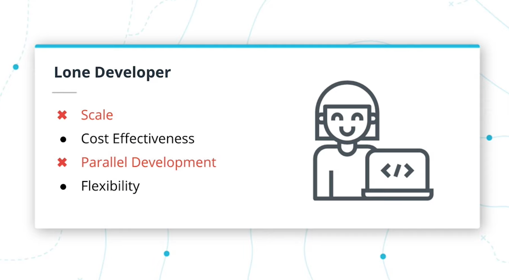](#img-srcdocs03_microservicesms_compare_developerpng-width500-alt)
        - [Microservice Architecture Designs](#microservice-architecture-designs)
        - [Solution Microservice Architecture](#solution-microservice-architecture)
- [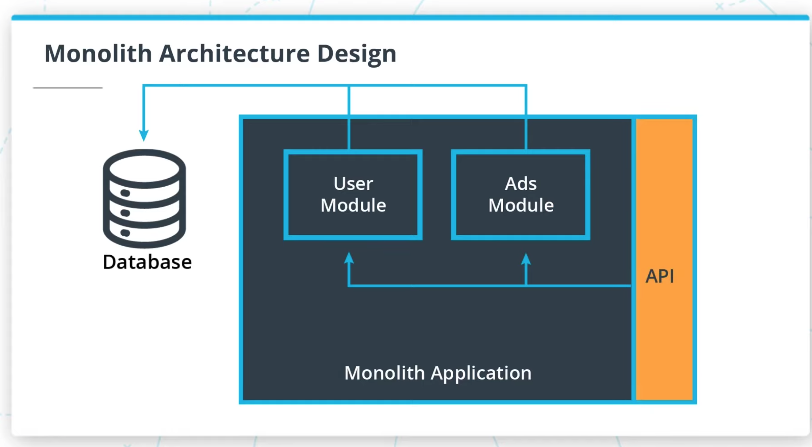](#img-srcdocs03_microservicesms_monolithpng-width500-alt)
        - [Divide a Monolith Application Into Microservices](#divide-a-monolith-application-into-microservices)
    - [Containers Using Docker](#containers-using-docker)
    - [Authomating the Application Development Lifecycle](#authomating-the-application-development-lifecycle)
    - [Orchestration with Kubernates](#orchestration-with-kubernates)
    - [Best Practices/Design Patterns for Kubernetes in Production](#best-practicesdesign-patterns-for-kubernetes-in-production)
    - [Refactor Monolith to Microservices and Deploy](#refactor-monolith-to-microservices-and-deploy)
- [Develop & Deploy Serverless App](#develop--deploy-serverless-app)
- [Capstone](#capstone)

<!-- /TOC -->


## Intro

https://udacity.github.io/git-styleguide/  

__Project Portfolio__  
* Real-world projects are integral to every Udacity Nanodegree program. They become the foundation for a job-ready portfolio to help learners advance their careers in their chosen field. The projects in the Cloud Developer Nanodegree program were designed in collaboration with a group of highly talented industry professionals to ensure you develop the most in-demand skills. Every project in a Nanodegree program is human-graded by a member of Udacity’s mentor and reviewer network. These project reviews include detailed, personalized feedback on how you can improve their work. Udacity graduates consistently rate projects and project reviews as one of the best parts of their experience with Udacity.

__Project 1__ 
* Deploy Static Website on AWS
The cloud is perfect for hosting static websites that only include HTML, CSS, and JavaScript files that require no server-side processing. In this project, you will deploy a static website to AWS. First, you will create a S3 bucket, configure the bucket for website hosting, and secure it using IAM policies. Next, you will upload the website files to your bucket and speed up content delivery using AWS’s content distribution network service, CloudFront. Lastly, you will access your website in a browser using the unique S3 endpoint.

__Project 2__ 
* Udagram: your own Instagram on AWS
In this project, you will develop a cloud-based application for uploading, listing, and filtering images. You will use Node.js/Express, a popular javascript framework for networked application development to develop this application. You will implement a REST API to issue commands using HTTP, store data in Amazon Web Services Relational Data Service (RDS) and S3, extend the codebase with secure authentication signon features, and deploy to Amazon Web Services Elastic Beanstalk. These are the hard skills you’ll need in any Cloud developer role.

__Project 3__   
* Refactor Udagram app into Microservices and deploy using Kubernetes
In this project, you will reuse their existing Udagram application and convert and extend into a microservice architecture. After the application is divided into smaller service, you will containerize it and deploy it to a Kubernetes cluster. This includes the deployment pipeline, scalability, observability, services, networking, and deployment strategies to service the system. You will then implement and interpret performance, usage, and logs to solve real problems similar to those they would encounter in the field.

__Project 4__ 
* Serverless Application
In this project you will develop an Instagram-like serverless service for uploading, listing, and filtering images. You will begin with building serverless REST APIs using API Gateway and AWS Lambda, a stack of serverless technologies on AWS. You will then implement an API to interact with this application, store data in AWS DynamoDB, S3, and Elasticsearch, secure your application with authentication, and deploy to Amazon Web Services using a Serverless framework.

__Project 5__
* Capstone Project
The purpose of the cloud development capstone project is to give you a chance to combine what you've learned throughout the program. This project will be an important part of your portfolio that will help you achieve your cloud development-related career goals.  
In the capstone project, each project is unique to the student. You’ll build an application on AWS based on predefined criteria. Students will define the scope of the project, come up feature list and decide which AWS services to use to meet availability and performance criteria.


## Cloud Fundamentals
### Cloud Computing

### Foundational & Compute Service
#### EC2: Elastic Cloud Compute
* Elastic Cloud Compute or EC2 is a foundational piece of AWS' cloud computing platform and is a service that provides servers for rent in the cloud.
* Pricing Options: there are several pricing options for EC2.
    * On Demand - Pay as you go, no contract.
    * Dedicated Hosts - You have your own dedicated hardware and don't share it with others.
    * Spot - You place a bid on an instance price. If there is extra capacity that falls below your bid, an EC2 instance is provisioned. If the price goes above your bid while the instance is running, the instance is terminated.
    * Reserved Instances - You earn huge discounts if you pay up front and sign a 1-year or 3-year contract.

#### EBS: Elastic Block Store
* Elastic Block Store (EBS) is a storage solution for EC2 instances and is a physical hard drive that is attached to the EC2 instance to increase storage.

#### VPC: Virtual Private Cloud
* Virtual Private Cloud or VPC allows you to create your own private network in the cloud. 
* You can launch services, like EC2, inside of that private network. 
* A VPC spans all the Availability Zones in the region.
* VPC allows you to control your virtual networking environment, which includes:  
    * IP address ranges
    * subnets
    * route tables
    * network gateways
    
#### Lab - Launch an EC2 instance
In this hands-on exercise, you will launch a virtual server in the cloud within a secure network. You will also manage additional storage options for your server.

* By the end of this lab, you will be able to:
* Launch a secure EC2 (Elastic Cloud Compute) instance within a VPC (Virtual Private Cloud)
* Manage an EBS volume
* Steps
    1. __Access VPC service from AWS Management Console__
        * On the AWS Management Console page, type _vpc_ in the _Find Services_ box and then select VPC.
        * Click the _Launch VPC Wizard_ button and select _VPC with a Single Public Subnet_. Important: In the VPC Name text box, enter a name for the VPC, and then select the first AZ from the Availability Zone dropdown. Leave everything else as the defaults.
        * Select _Create VPC_ button.
        * You should see the _VPC Successfully Created_ page, click the OK button in the far right. Important: You should see a table that lists all of the VPCs, make a note of the one just created.
    2. Launch an EC2 instance
        * Navigate to the EC2 console page, by clicking on _Services_ in the upper left-hand menu. Type _EC2_ in the text box and click on EC2 found in the search results.
        * On the EC2 Dashboard page, click on _Instances_ in the left-hand navigation.
        * Click __Launch Instance__.
        * Select the _Amazon Linux 2 AMI (HVM), SSD Volume Type__ Amazon Machine Image (AMI). Important: You are free to choose a different AMI, but to avoid excessive charges, pick one that says, Free Tier Eligible.
        * For the Instance Type, select the free-tier instance type of __t2.micro__.
        * Click on Next: _Configure Instance Details_.
        * Enter the 1 for the Number of Instances.
        * For Purchasing option, leave unchecked.
        * For Network, select the VPC that was created in the previous step, and then select the subnet in to which to launch the instance.
        * Keep the other default settings on this page as is.
    3. Attach an EBS volume
        * Click on _Next: Add Storage_ to attach an EBS volume. Important: Here we already see there is a root volume (or device) attached to your instance, this is an EBS volume. We are going to add additional storage.
        * To attach additional storage, click on Add New Volume.
        * Select Delete on Termination and keep the other default settings.
        * Click Review and Launch.
        * Click Launch
        * Generate and download a new key pair and then click Launch Instances. Important: This will allow you to SSH into your instance from your local machine. This is a one-time process, so generate and download the new key pair now.
        * The launch will take a couple of minutes, select View Instances during the wait.
        * Check the instance state, it should say running.
    4. Cleanup & Disable EC2 Instance To avoid recurring charges for leaving an instance running, let’s disable the EC2 instance and terminate the VPC
        * From the EC2 Dashboard, select the instance just created, click _Actions_, then _Instance State_, and then select _Terminate_.
        * From the VPC Dashboard, select the VPC just created, click _Actions_, then _Delete VPC_.

#### Lambda
AWS Lambda provides you with computing power in the cloud by allowing you to execute code without standing up or managing servers.
Tips
* Lambda is found under the Compute section on the AWS Management Console.
* Lambdas have a time limit of __15 minutes__.
* The code you run on AWS Lambda is called a __“Lambda function”__
* Lambda code can be triggered by other AWS services.
* AWS Lambda supports Java, Go, PowerShell, Node.js, C#/.NET, Python, and Ruby. There is a Runtime API that allows you to use other programming languages to author your functions.
* Lambda code can be authored via the console.

#### Lab: Lambda
1. __Create a Lambda Function__
  * On the AWS Management Console page, type lambda in the Find Services box and then select Lambda.
  * Click the “Create function” button and select Author from scratch.
  * Enter a Function name and select Node.js 8.10 as the runtime.
  * For Permission, click Choose or create an execution role, and select Create a new role with basic Lambda permissions.
  * Click Create function.

2. __Modify a Lambda Function__
  * Scroll down to the code for the Lambda function.
  * Replace the code on Line 5 with the statement below:
    ```js
    body: JSON.stringify('Hello ' + event.key1 + ' from Lambda!'),
    ```
  * Click the Save button in the upper right-hand corner.
  * Scroll down to the Basic Settings section.
    * For the Description, enter Udacity Function.
    * Change the Timeout from 3 seconds to 10 minutes.
    * Click the Save button in the upper right-hand corner.

3. __Test a Lambda Function__
  * Click on the Test button in the upper right-hand corner.
  * Ensure the Event template is Hello World.
  * For the Event name enter TestEvent Important: The name cannot contain spaces.
  * Update the JSON to the statement below, replacing the statement with your name.
    ```js
    {
    "key1": "Place your name here"
    }
    ```
     
4. Click Create.
5. Click the Test button in the upper right-hand corner again.
6. Scroll up to see the output in the Execution Results pane.
7. Review your results in the window.

#### Elastic Beanstalk
Elastic Beanstalks is an orchestration service that allows you to deploy a web application at the touch of a button by spinning up (or provisioning) all of the services that you need to run your application.
__Tips__
* Elastic Beanstalk is found under the Compute section of the AWS Management Console.
* Elastic Beanstalk can be used to deployed web applications developed with Java, .NET, PHP, Node.js, Python, Ruby, Go, and Docker.
* You can run your applications in a VPC.


### Storage & Content Delivery
* Storage in the Cloud
  * Storage and database services in the cloud provide a place for companies to collect, store, and analyze the data they've collected over the years at a massive scale.
* Storage & Database Services
  * Amazon Simple Storage Service (Amazon S3)
  * Amazon Simple Storage Service (Amazon S3) Glacier
  * DynamoDB
  * Relational Database Service (RDS)
  * Redshift
  * ElastiCache
  * Neptune
  * Amazon DocumentDB

#### S3 & S3 Glacier
* Amazon Simple Storage Service (or S3) is an object storage system in the cloud.  
* S3 offers several [storage classes](https://aws.amazon.com/s3/storage-classes), which are different data access levels for your data at certain price points.
  * S3 Standard
  * S3 Glacier: data archiving purposes
  * S3 Glacier Deep Archive
  * S3 Intelligent-Tiering
  * S3 Standard Infrequent Access
  * S3 One Zone-Infrequent Access

* S3 properties:
  * Objects are stored in a bucket  
  * Hold millions of objects  
  * S3 bucket live in a region  
  * S3 bucket name must be globaly unique

* Uses case:
  * Static websties
  * content delivery
  * backup and recovery
  * archiving and big data
  * application data
  * hybrid cloud storage

* S3 Glacier: cheaper than S3, for data that you don't intend to access frequently, data retrieval can be few minutes up to hours.
For data infrequently access.  
* Resources
  * [Amazon S3](https://aws.amazon.com/s3/)  
  * [Amazon S3 Glacier](https://aws.amazon.com/glacier/)  
  * [What is Amazon S3 Glacier](https://docs.aws.amazon.com/amazonglacier/latest/dev/introduction.html)

#### DynamoDB
DynamoDB is a NoSQL document database service that is fully managed. Unlike traditional databases, NoSQL databases, are schema-less. Schema-less simply means that the database doesn't contain a fixed (or rigid) data structure.

Tips:  
* DynamoDB is found under the Database section on the AWS Management Console.
* DynamoDB can handle more than 10 trillion requests per day.
* DynamoDB is serverless as there are no servers to provision, patch, or manage.
* DynamoDB supports key-value and document data models.
* DynamoDB synchronously replicates data across three AZs in an AWS Region.
* DynamoDB supports GET/PUT operations using a primary key.

* Resources
  * [Amazon DynamoDB Overview](https://aws.amazon.com/dynamodb/)
  * [What is Amazon DynamoDB](https://docs.aws.amazon.com/amazondynamodb/latest/developerguide/Introduction.html)

#### Relational Database Service (RDS)
* RDS (or Relational Database Service) is a service that aids in the administration and management of databases. RDS assists with database administrative tasks that include upgrades, patching, installs, backups, monitoring, performance checks, security, etc.
* Database Engine Support
  * Oracle
  * PostgreSQL
  * MySQL
  * MariaDB
  * SQL Server

#### Redshift
* Redshift is a cloud data warehousing service to help companies manage big data. Redshift allows you to run fast queries against your data using SQL, ETL, and BI tools. Redshift stores data in a column format to aid in fast querying.
* Tips
  * Redshift can be found under the Database section on the AWS Management Console.
  * Redshift delivers great performance by using machine learning.
  * Redshift Spectrum is a feature that enables you to run queries against data in Amazon S3.
  * Redshift encrypts and keeps your data secure in transit and at rest.
  * Redshift clusters can be isolated using Amazon Virtual Private Cloud (VPC).

#### Lab: RDS
Steps
1. Launch MySQL Database
2. View Instance Details
3. Delete Database Instance

#### Content Delivery In The Cloud
* A Content Delivery Network (or CDN) speeds up delivery of your static and dynamic web content by caching content in an Edge Location close to your user base.

* The benefits of a CDN includes:
  * low latency
  * decreased server load
  * better user experience

#### Cloud Front
* CloudFront is used as a global content delivery network (CDN). Cloud Front speeds up the delivery of your content through Amazon's worldwide network of mini-data centers called Edge Locations.

* CloudFront works with other AWS services, as shown below, as an origin source for your application:
  * Amazon S3
  * Elastic Load Balancing
  * Amazon EC2
  * Lambda@Edge
  * AWS Shield

* Tips
  * CloudFront is found under the Networking & Content Delivery section on the AWS Management Console.
  * Amazon countinously adds new Edge Locations.
  * CloudFront ensures that end-user requests are served from the closest edge location.
  * CloudFront works with non-AWS origin sources.
  * You can use GeoIP blocking to serve content (or not serve content) to specific countries.
  * Cache control headers determine how frequently CloudFront needs to check the origin for an updated version your file.
  * The maximum size of a single file that can be delivered through Amazon CloudFront is 20 GB.
* Resources
  * [Amazon CloudFront Overview](https://aws.amazon.com/cloudfront/)
  * [What is Amazon CloudFront](https://docs.aws.amazon.com/AmazonCloudFront/latest/DeveloperGuide/Introduction.html)

  #### Lab: S3 & CloudFront
* In this hands-on exercise, you will create a S3 bucket with a Cloud Front distribution to speed up our the delivery of content to our website.
* Steps
  * Create S3 Bucket
  * Upload Object to Bucket
  * Create CloudFront Distribution
  * Delete Bucket and Distribution

### Security
* As adoption of cloud services has increased, so has the need for increased security in the cloud. The great thing about cloud security is that it not only protects data, it also protects applications that access the data. Cloud security even protects the infrastructure (like servers) that applications run on.

* The way security is delivered depends on the cloud provider you're using and the cloud security options they offer.

#### AWS Shield
 
* AWS Shield is a managed DDoS (or Distributed Denial of Service) protection service that safeguards web applications running on AWS.

* AWS Shield is a service that you get "out of the box", it is always running (automatically) and is a part of the free standard tier. If you want to use some of the more advanced features, you'll have to utilize the paid tier.
* Tips
  * AWS Shield can be found under the Security, Identity, & Compliance section on the AWS Management Console.
  * AWS Shield Standard is always-on, using techniques to detect malicious traffic.
  * AWS Shield Advanced provides enhanced detection.

#### AWS WAF
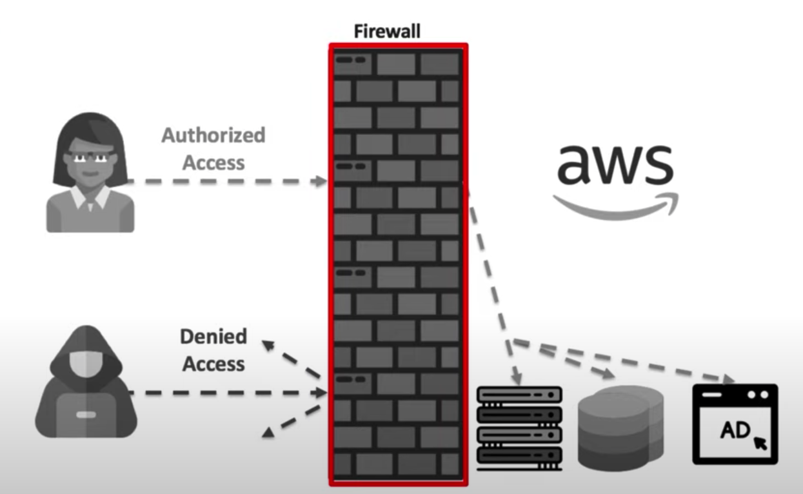  

* AWS WAF (or AWS Web Application Firewall) provides a firewall that protects your web applications.

* WAF can stop common web attacks by reviewing the data being sent to your application and stopping well-known attacks.

* Tips
  * WAF is found under the Security, Identity, & Compliance section on the AWS Management Console.
  * WAF can protect web sites not hosted in AWS through Cloud Front.
  * You can configure CloudFront to present a custom error page when requests are blocked.

#### Identity & Access Management
* Identity & Access Management (IAM) is an AWS service that allows us to configure who can access our AWS account, services, or even applications running in our account. IAM is a global service and is automatically available across ALL regions.
* __Security Concepts__
  * User
    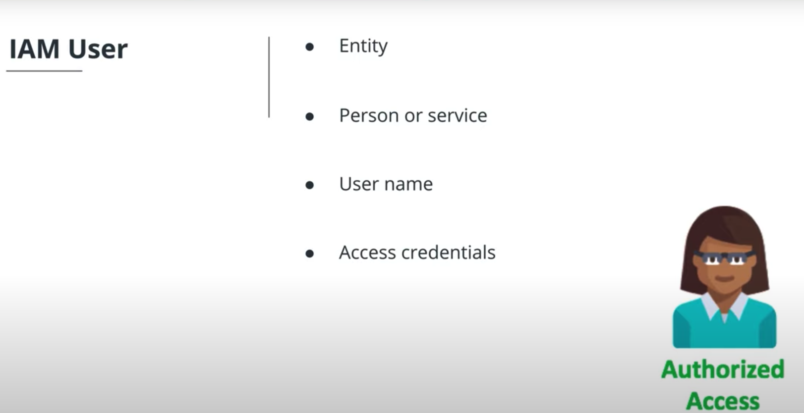   
  * IAM Group
    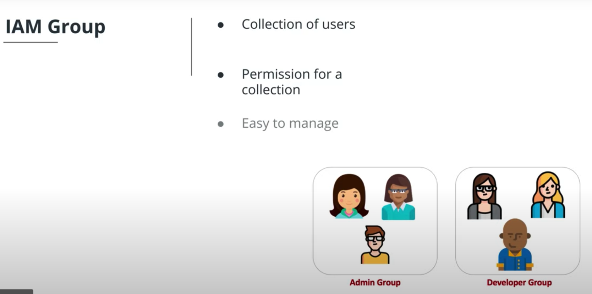     
  * IAM Role
         
  * Policy
    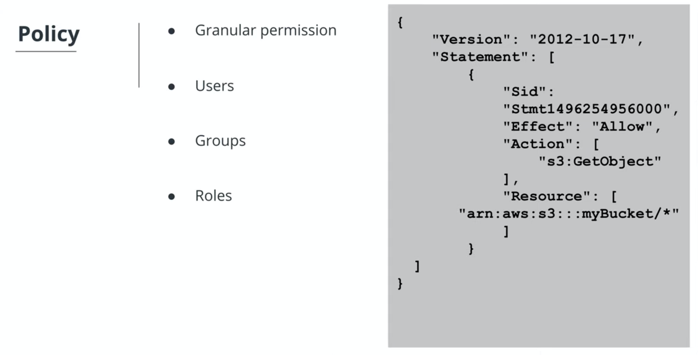     

* Resources
  * [AWS IAM Overview](https://aws.amazon.com/iam/)
  * [What is IAM](https://docs.aws.amazon.com/IAM/latest/UserGuide/introduction.html)

### Networking & Elasticity
* Networks reliably carry loads of data around the globe allowing for the delivery of content and applications with high availability. The network is the foundation of your infrastructure.

* Cloud networking includes:
  * network architecture
  * network connectivity
  * application delivery
  * global performance 
  * delivery

#### Route 53
* [Amazon Route 53 Overview](https://aws.amazon.com/route53/)
* Route 53 is a cloud domain name system (DNS) service that has servers distributed around the globe used to translates human-readable names like www.google.com into the numeric IP addresses like 74.125.21.147.
* Features
  * scales automatically to manage spikes in DNS queries
  * allows you to register a domain name (or manage an existing)
  * routes internet traffic to the resources for your domain
  * checks the health of your resources
* Tips
  * Route 53 is found under the Networking & Content Delivery section on the AWS Management Console.
  * Route 53 allows you to route users based on the user’s geographic location.

#### Elasticity in the Cloud
* One of the main benefits of the cloud is that it allows you to stop guessing about capacity when you need to run your applications. Sometimes you buy too much or you don't buy enough to support the running of your applications.

* With elasticity, your servers, databases, and application resources can automatically scale up or scale down based on load.

#### EC2 Auto Scaling
* EC2 Auto Scaling is a service that monitors your EC2 instances and automatically adjusts by adding or removing EC2 instances based on conditions you define in order to maintain application availability and provide peak performance to your users.

* Features
  * Automatically scale in and out based on needs.
  * Included automatically with Amazon EC2.
  * Automate how your Amazon EC2 instances are managed.
* Tips
  * EC2 Auto Scaling is found on the EC2 Dashboard.
  * EC2 Auto Scaling adds instances only when needed, optimizing cost savings.
  * EC2 predictive scaling removes the need for manual adjustment of auto scaling parameters over time.
* Resources
  * [Amazon EC2 Autoscaling Overview](https://aws.amazon.com/ec2/autoscaling/) 
  * [What is Amazon EC2 Autoscaling](https://docs.aws.amazon.com/autoscaling/ec2/userguide/what-is-amazon-ec2-auto-scaling.html)

#### Elastic Load Balancing
  

* Elastic Load Balancing automatically distributes incoming application traffic across multiple servers.
* Elastic Load Balancer is a service that:
  * Balances load between two or more servers
  * Stands in front of a web server
  * Provides redundancy and performance
* Tips
  * Elastic Load Balancing can be found on the EC2 Dashbaoard.
  * Elastic Load Balancing works with EC2 Instances, containers, IP addresses, and Lambda functions.
  * You can configure Amazon EC2 instances to only accept traffic from a load balancer.

#### Lab - EC2 Auto Scaling
[PDF](https://github.com/AntonioDiaz/cloud_developer/blob/master/docs/01_cloud_fundamentals/lab_elastic_load_balancer.pdf)


### Messaging & Containers
* There are often times that users of your applications need to be notified when certain events happen. Notifications, such as text messages or emails can be sent through services in the cloud. The use of the cloud offers benefits like lowered costs, increased storage, and flexibility.
---
#### Simple Notification Service (SNS)
* Amazon Simple Notification Service (or SNS) is a cloud service that allows you to send notifications to the users of your applications. SNS allows you to decouple the notification logic from being embedded in your applications and allows notifications to be published to a large number of subscribers.
* Features
  * SNS uses a publish/subscribe model.
  * SNS can publish messages to Amazon SQS queues, AWS Lambda functions, and HTTP/S webhooks.
* Tips
  * SNS uses a publish/subscribe model.
  * SNS can publish messages to Amazon SQS queues, AWS Lambda functions, and HTTP/S webhooks.
* Resources
  * [Amazon SNS Overview](https://aws.amazon.com/sns/)
  * [What is Amazon SNS](https://docs.aws.amazon.com/sns/latest/dg/welcome.html)  
---
#### Queues
* A queue is a data structure that holds requests called messages. Messages in a queue are commonly processed in order, first in, first out (or FIFO).
* Messaging queues improve:
  * performance
  * scalability
  * user experience
---
#### Simple Queue Service (SQS)
* Amazon Simple Queue Service (SQS) is a fully managed message queuing service that allows you to integrate queuing functionality in your application. SQS offers two types of message que∫ues: standard and FIFO.
* Features
  * send messages
  * store messages
  * receive messages
* Tips
  * The Simple Queue Service (SQS) is found under the Application Integration on the AWS Management Console.
  * FIFO queues support up to 300 messages per second.
  * FIFO queues guarantee the ordering of messages.
  * Standard queues offer best-effort ordering but no guarantees.
  * Standard queues deliver a message at least once, but occasionally more than one copy of a message is delivered.
* Resources
  * [Amazon SQS Overview](https://aws.amazon.com/sqs/)
  * [What is Amazon SQS](https://docs.aws.amazon.com/AWSSimpleQueueService/latest/SQSDeveloperGuide/welcome.html)  
---
#### Lab: SNS
* Topics Covered:
  * Create a topic
  * Subscribe to a topic
  * Publish a message to a topic
[PDF](https://github.com/AntonioDiaz/cloud_developer/blob/master/docs/01_cloud_fundamentals/lab_sns.pdf)
---
#### Containers in the Cloud
* Enterprises are adopting container technology at an explosive rate. A container consists of everything an application needs to run: the application itself and its dependencies (e.g. libraries, utilities, configuration files), all bundled into one package.
* Each container is an independent component that can run on its own and be moved from environment to environment.
* We will be going more in-depth on the topic of Microservices in Course 4: Microservices at Scale using AWS & Kubernetes
  * [General overview about Docker containers](https://docs.docker.com/engine/docker-overview/)
  * [Documentation on Docker Containers](https://www.docker.com/resources/what-container)
---
#### Elastic Container Service (ECS)
* ECS is an orchestration service used for automating deployment, scaling, and managing of your containerized applications. ECS works well with Docker containers by:
  * launching and stopping Docker containers
  * scaling your applications
  * querying the state of your applications
* Tips
  * ECS is under the Compute section on the AWS Management Console.
  * You can schedule long-running applications, services, and batch processeses using ECS.
  * Docker is the only container platform supported by Amazon ECS.  
* Resources
  * [Amazon ECS Overview](https://aws.amazon.com/ecs/)
  * [What is Amazon ECS](https://docs.aws.amazon.com/AmazonECS/latest/developerguide/Welcome.html)
---
### AWS Managment
#### Logging In The Cloud
* Logging provides visibility into your cloud resources and applications. For applications that run in the cloud, you will need access to logging and auditing services to help you proactively monitor your resources and applications.
* Logging allows you to answer important questions like:
  * How is this server performing?
  * What is the current load on the server?
  * What is the root cause of an application error that a user is seeing?
  * What is the path that leads to this error?  
---
#### Cloud Trail
* Cloud Trail allows you to audit (or review) everything that occurs in your AWS account. Cloud Trail does this by recording all the AWS API calls occurring in your account and delivering a log file to you.
* Features
  * CloudTrail provides event history of your AWS account activity, including:
    * who has logged in
    * services that were accessed
    * actions performed
    * parameters for the actions
    * responses returned
  * This includes actions taken through the AWS Management Console, AWS SDKs, command line tools, and other AWS services.
* Tips
  * Cloud Trail is found under the Management & Governance section on the AWS Management Console.
  * CloudTrail shows results for the last 90 days.
  * You can create up to five trails in an AWS region.
* Resources
  * [AWS CloudTrail Overview](https://aws.amazon.com/cloudtrail/)
---
#### Cloud Watch
* Cloud Watch is a service that monitors resources and applications that run on AWS by collecting data in the form of logs, metrics, and events.
* There are several useful features:
  * Collect and track metrics
  * Collect and monitor log files
  * Set alarms and create triggers to run your AWS resources
  * React to changes in your AWS resources
* Tips
  * CloudWatch is found under the Management & Governance section on the AWS Management Console.
  * Metrics are provided automatically for a number of AWS products and services.
* Resources
  * [AWS CloudWatch Overview](https://aws.amazon.com/cloudwatch/)
  * [What is Amazon CloudWatch](https://docs.aws.amazon.com/AmazonCloudWatch/latest/monitoring/WhatIsCloudWatch.html)
---
#### Lab: Cloud Watch
* Topics covered:
  * Create Cloud Watch event to react to the creation of an Amazon EC2 instance
  * Send SNS notification via Cloud Watch when an event occurs.
* [PDF](https://github.com/AntonioDiaz/cloud_developer/blob/master/docs/01_cloud_fundamentals/lab_cloud_watch.pdf)  
---
#### Infrastructure as Code
* Infrastructure as Code allows you to describe and provision all the infrastructure resources in your cloud environment. You can stand up servers, databases, runtime parameters, resources, etc. based on scripts that you write. Infrastructure as Code is a time-saving feature because it allows you to provision (or stand up) resources in a reproducible way.
* [wikipedia](https://en.wikipedia.org/wiki/Infrastructure_as_code)
---
#### Cloud Formation
* AWS Cloud Formation allows you to model your entire infrastructure in a text file template allowing you to provision AWS resources based on the scripts you write.
* Tips
  * Cloud Formation is found under the Management & Governance section on the AWS Management Console.
  * Cloud Formation templates are written using JSON or YAML.
  * You can still individually manage AWS resources that are part of a CloudFormation stack.
* Resources
  * [AWS CloudFormation Overview](https://aws.amazon.com/cloudformation/)
  * [What is AWS CloudFormation](https://docs.aws.amazon.com/AWSCloudFormation/latest/UserGuide/Welcome.html)
---
#### Lab: Cloud Formation
* Topics Covered
  * Create a CloudFormation stack using the CloudFormation Designer
  * Launch S3 bucket using Infrastructure as Code
  * Save and deploy a CloudFormation stack
  * View resources created through CloudFormation
* [pdf](https://github.com/AntonioDiaz/cloud_developer/blob/master/docs/01_cloud_fundamentals/lab_cloud_formation.pdf)  
---
#### AWS Command Line Interface (CLI)
* The AWS CLI (or Command Line Interface) allows you to access and control services running in your AWS account from the command line. To use the CLI, simply download, install, and configure it.
* Tips
  * The AWS CLI allows you to work with AWS services in a programmatic manner
* Resources
  * [AWS Command Line Interface](https://aws.amazon.com/cli/)
---
### Deploy Static Website on AWS
#### Cloud Fundamentals Project
* The cloud is perfect for hosting static websites that only include HTML, CSS, and JavaScript files that require no server-side processing. In this project, you will deploy a static website to AWS. 
* Steps 
  1. You will create a S3 bucket and upload the website files to your bucket. 
  2. You will configure the bucket for website hosting and secure it using IAM policies. 
  3. You will speed up content delivery using AWS’ content distribution network service, CloudFront. 
  4. You will access your website in a browser using the unique CloudFront endpoint.

* Topics Covered
  * S3 bucket creation
  * S3 bucket configuration
  * Website distribution via CloudFront
  * Access website via web browser  
* Dependencies
  * Cloud Services
    * Amazon Web Services S3 - Resource hosting and deployments
    * AWS CloudFront - CDN for SPA
    * AWS EKS - Backend API
    * AWS DynamoDB - Persistent Datastore
    * AWS Cognito - User Authentication
  * Performance Tracking and DevOps Tools
    * AWS CloudWatch - Performance and Health checks
    * Sentry - Bug Reporting
      * Alternates:
      * TBD
    * Google Analytics - Usage Reporting
      * Alternates:
      * Mixpanel
    * Travis (CI/CD)
  * Frameworks:
    * Ionic (Javascript) (Frontend)
    * Node.js (Javascript) (Backend)
---
#### Steps
* [Create S3](https://github.com/AntonioDiaz/cloud_developer/blob/master/docs/01_cloud_fundamentals/deploy_static_s3.pdf)
* [Upload content](https://github.com/AntonioDiaz/cloud_developer/blob/master/docs/01_cloud_fundamentals/deploy_static_upload.pdf)
* [Secure Bucket via IAM](https://github.com/AntonioDiaz/cloud_developer/blob/master/docs/01_cloud_fundamentals/deploy_static_secure.pdf)
* [Configure S3 Bucket](https://github.com/AntonioDiaz/cloud_developer/blob/master/docs/01_cloud_fundamentals/deploy_static_config_s3.pdf)
* [Distribute Website via CloudFront](https://github.com/AntonioDiaz/cloud_developer/blob/master/docs/01_cloud_fundamentals/deploy_static_cloudfront.pdf)
* [Access Website in Web Browser](https://github.com/AntonioDiaz/cloud_developer/blob/master/docs/01_cloud_fundamentals/01_cloud_fundamentals/deploy_static_access.pdf)


## Full Stack Apps on AWS
### Lesson 1: Cloud Basic
#### Cloud Basics and Parts of a Cloud
* Key Terminology
  * __Data__: we store digital data as bytes on physical media like hard drives, but in the cloud, we use systems to simplify this for us.
  * __Filestore or Filesystem__: A system to save, archive, and recall specific documents and media. Usually, a file store offers low cost per unit space optimized for larger files.
  * __Database__: A system to save and organize complex data models. They often use more advanced data structures to index and organize data for faster lookup time. Databases are compelling solutions for data models that have complicated relationships.
  * __Compute__: any computer operation requires some computation on a CPU (central processing unit).
  * __Server__: A specialized computer for cloud and web services.
  * __Instance__: A computational unit which may be a physical server or a virtual server that is abstracted by a cloud service.
  * __Cluster__: A collection of instances which perform the same function. It may be used to distribute workloads.
  * __Autoscaling Group__: A type of cluster that can increase or decrease the number of instances based on demand.
---

#### Monolithic vs. Loosely Coupled Systems
* Loosely coupled systems are recommended over monolithic systems, as they reduce technical debt.
* __Technical Debt__  
The cost (in time and resources) of additional code rework caused by choosing an easy solution now instead of using a better approach that would take longer to implement.

* __Microservices__  
Microservices are individual specialized systems (software deployed on specialized infrastructure) designed to accomplish a specific task. Specific tasks may include things like authentication, image processing, or data management.

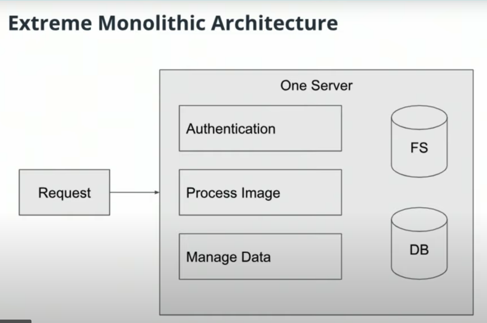 

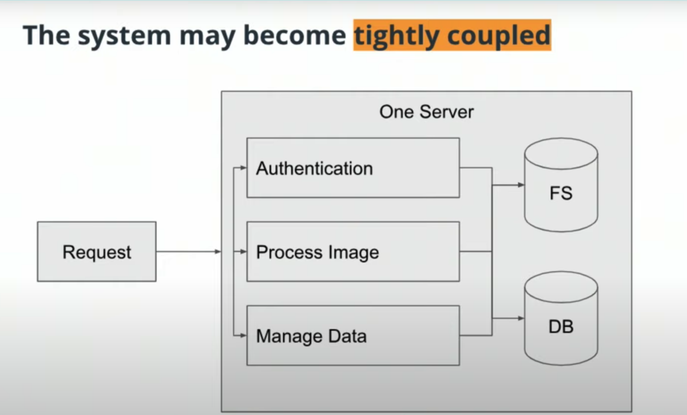 

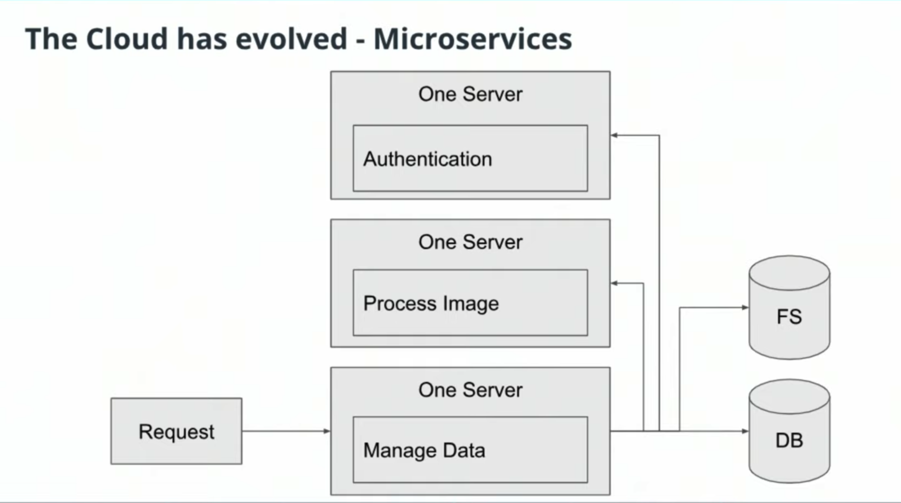 
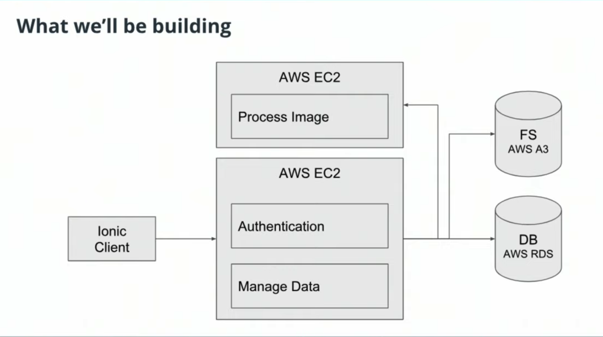 

---

#### Request Response and APIs
* URL format.
* HTTP request format.
* [HTTP status codes](https://www.restapitutorial.com/httpstatuscodes.html)
---

### Lesson 2: develop
#### Getting Setup
* Installing Node and NPM  
This project depends on Nodejs and Node Package Manager (NPM). Before continuing, you must download and install Node (NPM is included) from https://nodejs.com/en/download.
* Installing Ionic Cli  
The Ionic Command Line Interface is required to serve and build the frontend. Instructions for installing the CLI can be found in the [Ionic Framework Docs](https://ionicframework.com/docs/installation/cli).
* Installing Python3  
Python is a powerful programming language used for anything from quick scripts through data science. We'll use Python for the final project and it is required for some development tools like the AWS CLI. Instructions to download and install Python for your OS can be found here: https://www.python.org/downloads/
* Amazon Web Services (AWS)
  * Account Setup  
We'll be provisioning cloud resources throughout the next few lessons. You'll need an AWS account to set up these resources. We'll be taking advantage of the free tier offerings so there should be no costs to set up the resources we'll be using. Create a new account here: https://portal.aws.amazon.com/billing/signup#/

  * AWS CLI  
We'll interface with AWS using the Command Line Interface (CLI). Instructions to download and install the AWS CLI for your OS can be found here: https://docs.aws.amazon.com/cli/latest/userguide/cli-chap-install.html

* Installing useful tools
  * Postbird -> https://github.com/paxa/postbird  
Postbird is a useful client GUI (graphical user interface) to interact with our provisioned Postgres database. We can establish a remote connection and complete actions like viewing data and changing the schema (tables, columns, ect).

  * Postman -> https://www.getpostman.com/downloads/ 
Postman is a useful tool to issue and save requests. Postman can create GET, PUT, POST, etc. requests complete with bodies. It can also be used to test endpoints automatically. We've included a [collection in the starter code repository](https://github.com/udacity/cloud-developer/blob/master/course-02/exercises/udacity-c2-restapi/udacity-c2-restapi.postman_collection.json) (./udacity-c2-restapi.postman_collection.json) which contains example requests.

#### How to desing an API  
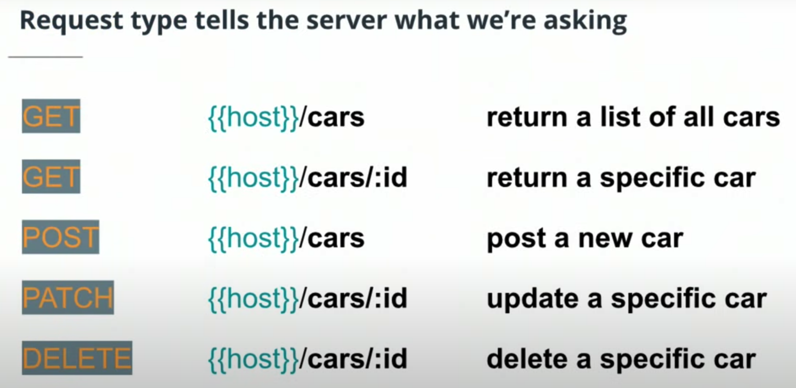 

*  Only user noums and no verbs.  
They should be plural and consistent.
* APIs should be versioned  
  > {{host}}/api/v0/cars/5
* List should be paginated to limit the amount of date sent
  > {{host}}/api/v0/cars/?ofset=50&limit=10
* All responses should be attempt to use status codes
* All responses should include data format
  * i.e. application/json
* Error payloads should include

#### Standing up a Cloud Capable Server
* Introduction to Node  
Node (aka NodeJs) is a powerful framework to build network applications using JavaScript (in our case using TypeScript) outside of browsers. It has an asynchronous concurrent model which releases the developer from many concerns involving threading and dead-locking.  
Node is used as our server framework along with Express to handle web http requests and responses.  
Node -> https://nodejs.org/en/  
Express -> https://expressjs.com/insert%20link
* Introduction to TypeScript  
Typescript is a flavor of JavaScript that forces hard typing on variables and methods. This prevents implementation errors like passing a string instead of a number. It compiles to pure JavaScript.  
https://github.com/Microsoft/TypeScript

* Github link to basic server  
  * In this lesson, we'll be referencing a prewritten, simple server which uses Node/Express.  
  * The github link to clone and follow along is: https://github.com/grutt/udacity-c2-basic-server.  
  * Alternatively, you can clone the repo for the entire nanodegree cloud-developer and find the files for this course in the path https://github.com/udacity/cloud-developer/tree/master/course-02/exercises
* Clone Repository
* Installing project dependencies  
  * This project uses NPM to manage software dependencies. NPM Relies on the package.json file located in the root of this repository.  
  * After cloning, open your terminal in the repo directory and run:  
     * > npm install
* Understanding the Code
* Running our server and making requests
  * > npm run dev

#### Verification Testing
* Unit Tests  
Ensure our atomic functions and methods perform their tasks correctly or fail appropriately. We'll be playing with Mocha and Chai as our unit testing framework. We'll be covering the basics so checkout the docs!  
https://mochajs.org/

* Integration Tests  
Integration Tests ensure every endpoint in our software package perform their tasks correctly, fails appropriately, and communicates with other systems in a predictable manner (so they integrate properly). We'll be playing with Postman as our integration testing framework. We'll be covering the basics so checkout the docs!
---
#### Using Git Effectively for the Cloud

### Lesson 3: storing data in the cloud
#### Difficulties ofd Persistent Data
* __RAM (Random Access Memory)__: Data can be accessed quickly, but is erased once the server restarts. It may be okay to use RAM when prototyping, and later replace it with a database.
* __Hard Drive Disk__: Data remains after server restarts, but is specific to that server (not shared across servers).
* __Race Condition__: When an application’s behavior is dependent on other uncontrollable events. This is an issue with storing data on disks or RAM of multiple servers.
* __Relational Database__: can store at scale, improve search runtime, and maintain relationships between data fields. We recommend using a database for storing data.

#### Database Basics
* Indexing Our Data for Better Recall
* NoSQL - Simple Key:Value Stores
* Relational Databases - Structured and Queryable Datastores  

__B-Tree__: a generalization of a binary search tree, which stores sorted data, but can have more than 2 child nodes.  
__Bloom Filters__: a data structure that is useful for determining if an item is probably in a data set, or definitely not in the data set. Bloom filters don’t actually store the data themselves.  
__primary key and foreign key__: The primary consists of one or more column in a table that are unique to each record (each row). A foreign key in a table contains the primary key of another table.  

__Scaling out__ -> noSQL easier         -> more instances  
__Scale up__    -> SQL database easier  -> make computer bigger (more CPU, RAM,...)

#### Provisioning a Cloud Database
* Configuring Amazon Web Services' Relational Database Service
* Allowing Public Traffic to RDS
* Interfacing with our Database using Postbird
* Connecting to RDS with Postbird
* Creating Tables in RDS with Postbird
* Making SQL Commands with Postbird

#### Filestore Basics
* File stores allow for archiving data. In AWS, the file store is called S3, and the archive resource is called “glacier”.
* Content Delivery Network (CDN): are a network of proxy servers that are placed closer to end users to deliver data and compute. CDNs reduce latency for end users.
* SignedURLs allow clients to send and receive data by directly communicating with the file store.  
This saves the server from using its bandwidth to serve as the intermediary that transmits data to and from the client.   
This is faster for clients as well.
* Buckets: a simple directory-like system in which to store data.

* Signed URL pattern  
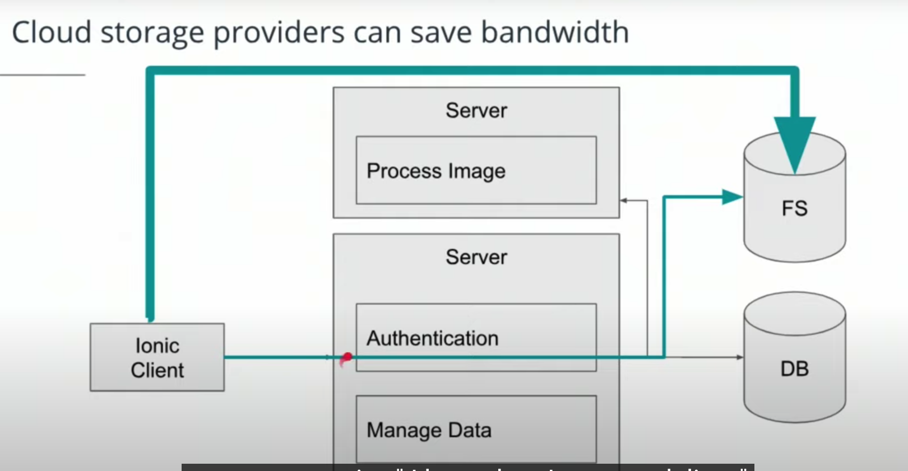  
  

---
#### Creating an S3 Filestore Bucket
* Create “dev” resources: Use the “dev” set of infrastructure (set of servers, filestores, databases) for development, and a separate set of infrastructure for production.
* AES 256: Advanced Encryption Standard with a 256-bit key. This is a popular encryption standard.
* CORS: Cross Origin Resource Sharing: defines how a client can interact with a resource, and what the client can and cannot do with that resource. Setting the CORS policy of our S3 bucket allows our client to communicate with the S3 bucket using the SignedURL pattern.

Bucket CORS Policy  
You'll need this policy to create a bucket where we can use the SignedURL pattern.
```xml
<?xml version="1.0" encoding="UTF-8"?>
<CORSConfiguration xmlns="http://s3.amazonaws.com/doc/2006-03-01/">
<CORSRule>
    <AllowedOrigin>*</AllowedOrigin>
    <AllowedMethod>POST</AllowedMethod>
    <AllowedMethod>GET</AllowedMethod>
    <AllowedMethod>PUT</AllowedMethod>
    <AllowedMethod>DELETE</AllowedMethod>
    <AllowedMethod>HEAD</AllowedMethod>
    <AllowedHeader>*</AllowedHeader>
</CORSRule>
</CORSConfiguration>
```
---
#### Understanding Secrets
* What are permissions?  
  * HIPPA: HIPAA (Health Insurance Portability and Accountability Act) is a law in the U.S that requires data privacy and security for medical information.
  * Use environment variables to store your username and password, to avoid hard-coding username and password information in your code.
  * Avoid committing your passwords to git. Use .gitignore to define files that you do not want to commit to git.
  * IAM user role: an IAM role can give a user a set of permissions to access one or more services.
  * IAM service role: an IAM role gives a service a set of permissions to access one or more services.
  
* User IAM profiles on AWS
  * It’s beneficial to create a role that contains a policy group (a set of permissions), rather than to assign individual permissions to a specific user.  
  Imagine if a user leaves the company and a new hire takes their place. Instead of re-assigning all the permissions needed for their job, we can assign the existing IAM role to that new employee.
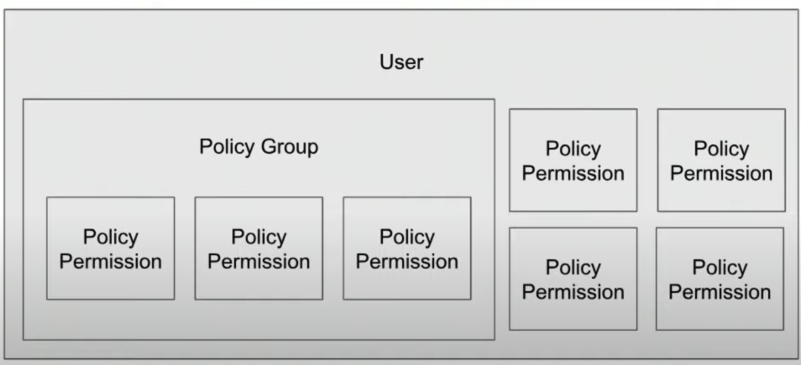  

* Creating User Profiles Using the AWS Console
  * Create user, download __credential.csv__.
  * Assign that user in a group.
  * Create a new policy and assing that policy to the new group.

* Installing AWS User IAM Profiles Locally
  * From the __credentials.csv__ you will need:
    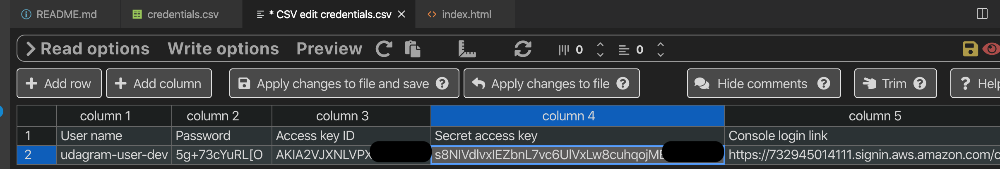      
    * Access key ID
    * Secret access key  
    
  * Run command: 
      > aws configure
  * This will add the profile to 
    * ~/.aws/credentials
    ```
    [default]
    aws_access_key_id=########################
    aws_secret_access_key=########################

    [profile1]
    aws_access_key_id=########################
    aws_secret_access_key=########################

    [profile2]
    aws_access_key_id=########################
    aws_secret_access_key=########################    
    ```
    * ~/.aws/config
    ```
    [default]
    region=us-east-1

    [profile1]
    region=us-west-2

    [profile2]
    region=us-east-2
    ```
* Creating IAM Service Roles  
  * Role is consumed by a service  
  * Role has policies asociated
---
### Lesson 4: building and deploying
#### Organizing Our Code
* Designing the Application to be Extensible
  * Features and Modularity  
    * In this concept, we dive into splitting our code into logical "features".  This is a way of describing modular programming where the code which relates to one task is grouped together.  
In this example, the __/feed__ and __/auth__ endpoints are our features.  
All routing, models, business logic, and helper functions for these modules should be separated as much as possible.  
This way, we have an understanding of where code responsibilities just by looking at the general structure.

    * Often one feature may depend on another feature - for example, user authentication will be needed within the feed. But these dependencies should be kept loose and consistent with only a few methods being consumed.  
    The goal as the system continues to grow, is to minimize refactoring outside of specific features. As you continue to learn cloud and explore microservices, often entire features might be ported to their own servers infrastructure making this loose coupling even more critical.  
    
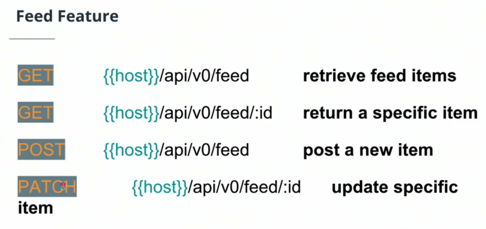    
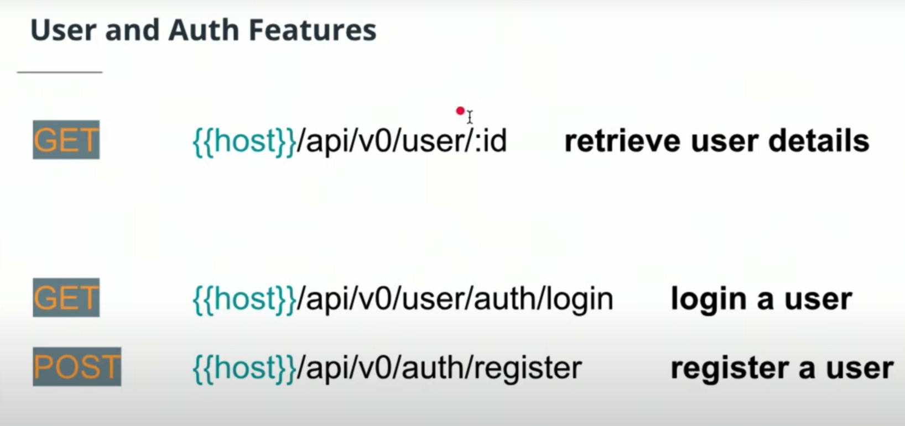    
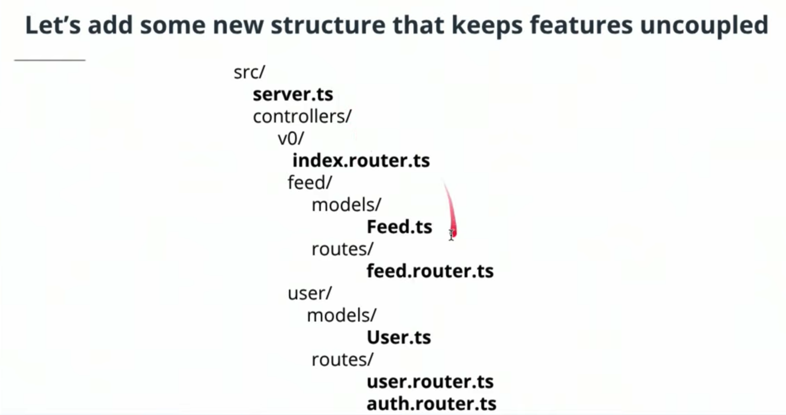    

* Github link to the project RestAPI Server  
In this lesson, we'll be referencing a stubbed, more complex server which uses Node/Express.  
The GitHub link to clone and follow along is in the exercises folder of the course repo: https://github.com/udacity/cloud-developer/tree/master/course-02/exercises/udacity-c2-restapi.

__Installing project dependencies__  
This project uses NPM to manage software dependencies. NPM Relies on the package.json file located in the root of this repository.  
After cloning, open your terminal in the repo directory and run:

> npm install

* RestAPI Source Walkthrough
  * Code Structure and Organization
    * In the file controllers/v0/feed/routes/feed.router.ts, the root directory router.get('/',... is not the server root directory.  
    The root in this case is based on where the server is entering from, which in this case, is api/v0/feed/routes.
    * We’ll keep S3 related code in its own file aws.ts, and database connection code in its own file sequelize.ts.  
---
#### Intro to Object-Relational Maps (ORM)
We'll be using an ORM called Sequelize to manage the connection to our database.  
We'll cover the basics in this concept, but Sequelize is a powerful tool and is extremely well documented at http://docs.sequelizejs.com/

* Models  
A model is the data representation of some group of data. In object-oriented programing terms, a model is an object and is represented by a new class. It should usually represent a noun such as a user, a feed item, an order, etc.  
We use the _@Table__ decorator and extend the base sequelize Model class to link our model to our database table.

* Parameters  
The model contains instance parameters.  
These can be other models or primitive fields.  
We use the __@Column__ decorator to link our parameters to the table columns.  
The bang symbol ! specifies if the field in the table can be null.  
Sequelize handles the datatype mappings from TypeScript types to Postgres column datatypes.

```js
import {Table, Column, Model, HasMany, PrimaryKey, CreatedAt, UpdatedAt, ForeignKey} from 'sequelize-typescript';
import { User } from '../../users/models/User';

@Table
export class FeedItem extends Model<FeedItem> {
  @Column
  public caption!: string;

  @Column
  public url!: string;

  @Column
  @CreatedAt
  public createdAt: Date = new Date();

  @Column
  @UpdatedAt
  public updatedAt: Date = new Date();
}
```

Read more at the Sequelize docs entry on models -> http://docs.sequelizejs.com/class/lib/model.js~Model.html

* ORMS allow us to easily switch to a different dialect of SQL (e.g. PostgreSQL, MySQL), without having to modify the code that interacts with the database. If we were to write SQL queries directly, instead of using an ORM, we would have to modify our SQL statements to be compatible with the dialect of the database that we are using.

* Migrations  
  * Migration refers to modifying the database (by adding or removing tables or columns, for instance, or switching to a different dialect of SQL) to a newer version (usually based on new business requirements).
  * Up migration is the process of modifying the database to a newer state.
  * Down migration is the process of reversing an up migration, to a prior state.
  
Read more at the Sequelize docs on migrations

>Note Migrations is a loaded term. We most commonly refer to migrations when changing database table states (new columns, adding tables, etc). However, it can also refer to migrating infrastructure - for examples Postgres to MySQL.

* Seeding  
Seeds are default rows of data that will be inserted upon database formation.  
This may be helpful when provisioning databases frequently for specific applications and having welcome data populated, or when running tests on staging systems to simulate real-world conditions.

Read more at the Sequelize docs on seeding -> http://docs.sequelizejs.com/manual/migrations.html#creating-first-seed

* Using Sequelize in our Node RestAPI Source Code
  * The following video uses PostBird to run SQL queries -> https://github.com/Paxa/postbird

  * In the video, we also go the AWS console to get the RDS endpoint.   
  To steps are: Go to AWS console, click RDS. In the new page, in the left-hand menu, click “Databases”. In the “connectivity & security” section, under “Endpoint”, copy the endpoint URL.  
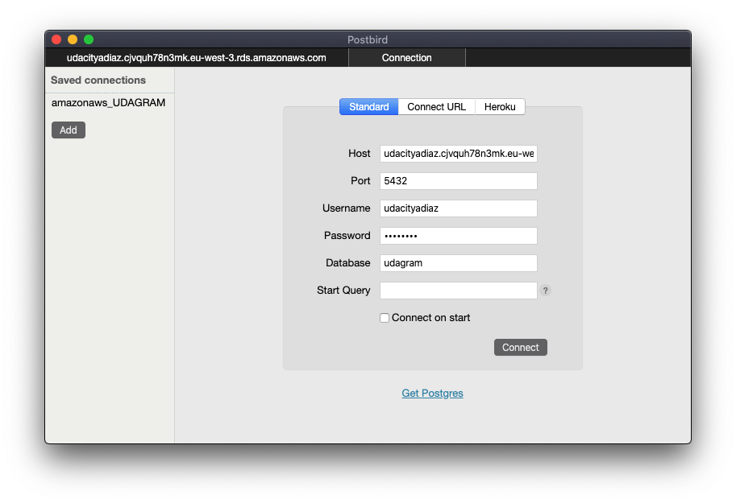  

* Decorators  
The Decorators (also known as Annotations) mentioned in this video are a feature of the sequelize-typescript package which allows us to link database features with our models.  
We exemplify this using the @CreatedAt and @UpdatedAt. This will set the option in the Postgres database to automatically set the date when any row is created, or updated and is useful when sorting and filtering our data.  
[Read more and view complete details on the model definition in the sequelize-typescript docs](https://www.npmjs.com/package/sequelize-typescript#model-definition)

* Enter __npm run dev__ in terminal to start the server

* Associations In Sequelize  
Check out the Sequelize documentation on associations to understand how to implement this pattern: http://docs.sequelizejs.com/manual/associations.html
---
#### Connecting our S3 Filestore in Node
* Signed URL Pattern  
  * We'll be using the Amazon Web Services (AWS) Javascript Software Development Kit (SDK) to implement the SignedURL pattern within our Node server.  
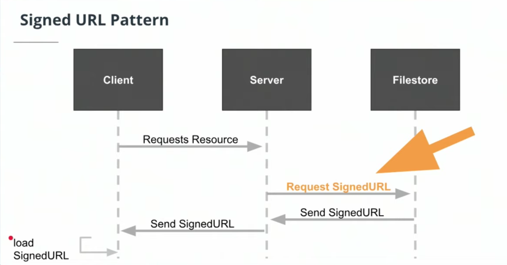  
* Tip  
AWS SDK dependencies are included in the project's package.json file.  
If you're starting a new project, you will need to install these dependencies using NPM.  
AWS offers clear instructions for setting it up in a new project: https://docs.aws.amazon.com/sdk-for-javascript/v2/developer-guide/installing-jssdk.html.

```js
//Configure AWS
var credentials = new AWS.SharedIniFileCredentials({profile: c.aws_profile});
AWS.config.credentials = credentials;

export const s3 = new AWS.S3({
  signatureVersion: 'v4',
  region: c.aws_region,
  params: {Bucket: c.aws_media_bucket}
});


/* getGetSignedUrl generates an aws signed url to retreive an item
 * @Params
 *    key: string - the filename to be put into the s3 bucket
 * @Returns:
 *    a url as a string
 */
export function getGetSignedUrl( key: string ): string{
  const signedUrlExpireSeconds = 60 * 5
    const url = s3.getSignedUrl('getObject', {
        Bucket: c.aws_media_bucket,
        Key: key,
        Expires: signedUrlExpireSeconds
      });
    return url;
}

/* getPutSignedUrl generates an aws signed url to put an item
 * @Params
 *    key: string - the filename to be retreived from s3 bucket
 * @Returns:
 *    a url as a string
 */
export function getPutSignedUrl( key: string ){
    const signedUrlExpireSeconds = 60 * 5
    const url = s3.getSignedUrl('putObject', {
      Bucket: c.aws_media_bucket,
      Key: key,
      Expires: signedUrlExpireSeconds
    });
    return url;
}
```
---
#### Handling Secrets with Environment Variables
1. __Shell__ - Linux/Mac Users  
    * For Unix/Linux/Mac operating systems, a shell is a command-line program that accepts users' commands and executes those commands on the underlying kernel. Each command has a specific job to perform.
    * There are multiple shells available. The default shell for (most) Linux systems is the bash shell. Other examples are ksh, tcsh, and zsh. The default shell for macOS 10+ is zsh.
    * Your default shell boots when you open a terminal, which allows you to execute commands.
2. __Environment Variables__ - Linux/Mac Users  
    * Assume you store the user-specific secrets, such as username, password, or private key, into a simple file. It might not be a safe approach because all the sensitive information may become public if you put that information on Github/any other Version Control System. User-specific secrets, visible publicly, are never a good thing.

    * Here comes the role of Environment variables in this scenario. Environment variables are pretty much like standard variables, in that they have a name and hold value. The environment variables only belong to your local system and won't be visible when you push your code to a different environment like Github.
  * The __.env__ file  
    * The .env file is one of the hidden files in which you can store your choice of environment variables.  
    * The variables stored in this file are your individual working environment variables.  
    * Note that the environment variables that are stored in the .env file override the variables set in the /etc/environment file, that is shared by all users of that computer. 
    * You will need to follow the steps below to configure environment variables in a .env file:  
        1. Install environment variables package:  
            ``` npm install dotenv --save  ```  
          This will allow you to use the environment variables that you'll set in a new file.
        2. Create a new .env file in the root of your project.  
        Fill the .env file with your new variables, and their corresponding values.  
        For example:  
            ```properties
            POSTGRES_USERNAME = yourUsername
            POSTGRES_PASSWORD = yourpassword
            AWS_REGION = yourAWSRegion
            AWS_PROFILE=awsProfileName 
            ```
        3. __Require the package in your server__ - Add the following code on top of the __server.ts__ file
        ```` require('dotenv').config(); ````  
        4. __Use your environment variables__ - If you want to refer the environment variables that you just saved in the .env file, anywhere in the code, try putting a prefix __process.env.__ in front of the variable name. For example, __process.env.POSTGRES_USERNAME__ will fetch you the value stored in it.
        5. Add __.env__ to your __.gitignore__ - You wouldn't want your .env file to be available publicly in the project Github repository. For this reason, go to the .gitignore file in the project root, and add and entry .env to it. It will make sure that you don't push our environment variables to Github!  
  * The process.env file
      * The process.env file is a default file that stores the variables for the current terminal environment. When you run the following command, it will store the POSTGRES_USERNAME to the current terminal environment:  
      ``` export POSTGRES_USERNAME = yourUsername ```  
      * By default, the Node is accessing the same set of variables that are defined in your process.env file.
  * Bash Profile - __.profile__ file  
    * You won't want to export the user-specific variables every time you'll log in to your system, and do not want to override the variables set in the root level /etc/environment file. 
    * The solution is to store the new variables either in .profile,.bashrc or .zshrc file, depending on your shell. 
    * These are the files that the shell executes even before you type your first command to it. 
    * Note that every user of the computer has its own __.profile__ file.
    * When you put  
    ``` export AWS_PROFILE=awsProfileName ```  
    * inside the .profile file, it will run this command before you start firing commands in your shell.
    * Usually, the bash profile is found at ~/.profile, where ~ represents your current logged in user's home directory. Keep in mind the . preceding profile means this file will be hidden.
    * If you wish to instruct your Node to execute the .profile file anytime, you can run the following command:  
    ``` source ~/.profile ```

* Adding to .zshrc file:
```properties
export POSTGRESS_USERNAME=xxxxx
export POSTGRESS_PASSWORD=xxxxxx
export POSTGRESS_DATABASE=udagram
export POSTGRESS_HOST=xxxxx.cjvquh78n3mk.eu-west-3.rds.amazonaws.com
export AWS_REGION=eu-west-3
export AWS_PROFILE=default
export AWS_MEDIA_BUCKET=udagram-xxxxx-dev
export JWT_SECRET=helloworld
```

---
#### Permissions for Elastic Beanstalk  
* Add permissions _AWSElasticBeanstalkFullAccess_ and _AdministratorAccess_   
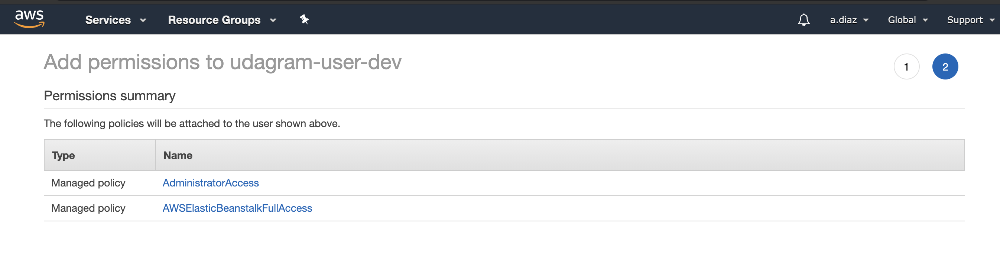 

---
#### Deploying Our Server to the Cloud
* Basic AWS Architecture  
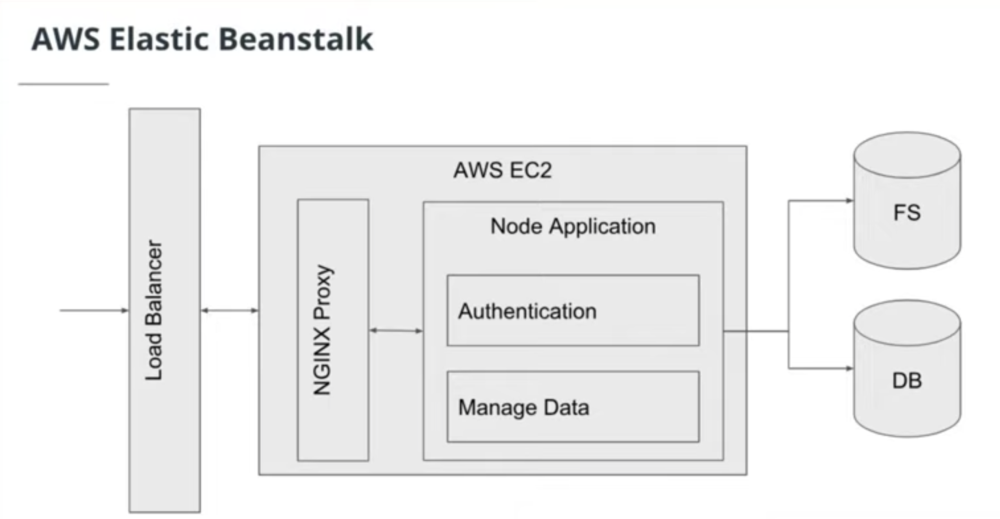  
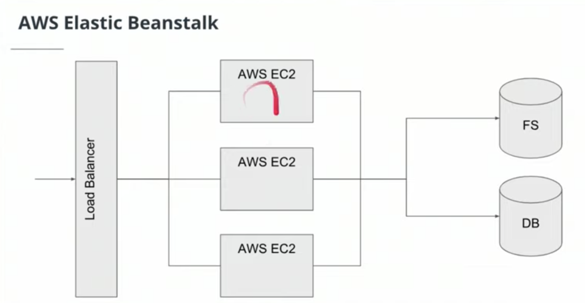  

* Build process
  1. Transpile TypeScript
  2. Include some source files
  3. Zip a file
  4. Upload to Elastic Beanstalk

* Using AWS Elastic Beanstalk  
Elastic Beanstalk is a powerful Development Operations tool (Dev Ops) to deploy your code to AWS services and infrastructure with minimal effort.

  * EB CLI  
    * We'll be using the Command Line Interface to work with Elastic Beanstalk.  
This will provide us with a set of commands to create new applications and deploy code to these systems.  
Before continuing, you must install the EB CLI by reading the [AWS Doc Instructions](https://docs.aws.amazon.com/elasticbeanstalk/latest/dg/eb-cli3-install.html) for Install for your platform.

    * After running the ```eb init``` command and following the guided setup will create a new directory in our project named ```.elasticbeanstalk```.  
    Within this configuration file, there is a configuration file named ```config.yml```.  
    This is the set of instructions Elastic Beanstalk will follow when provisioning your AWS infrastructure and deploying your code.

* Generating SSH Keypairs  
Public-Key Cryptography is a method to encrypt and decrypt authentication information for connecting to your resources in the cloud. The keys you generate replace your password, but they should be treated as sensitive data that would grant anyone who holds them access to your running instance. AWS offers a great guide on how to create [Key Pairs for your EC2 Instances](https://docs.aws.amazon.com/AWSEC2/latest/UserGuide/ec2-key-pairs.html).

* Creating Deployable Build Archives and Deploying  
  * Now that you have a running Beanstalk instance, we must package our code into a format that is usable by Elastic Beanstalk.  
  * We do this by transpiring our typescript into javascript and then zipping the contents into a single file which we can upload. NPM allows us to define simple script commands in the package.json file. As described in the video, we've included the build command to perform these steps for us.  
  * After running ```npm run build``` to transpile and package our code into a zip, we need to configure Elastic Beanstalk to use this build archive.  
  This is accomplished with the following addition to the .easticbeanstalk/config.yml configuration file:
    * Inside the .elasticbeanstalk folder there is a file ```config.yml```, this must be added:
      ```yml
      deploy:
        artifact: ./www/Archive.zip
      ```
* Setting Environment Variables in Elastic Beanstalk  
Just like our local code, we'll need to access certain variables from our system within our Node server. 
We can set these variables through the AWS Console.  
On aws console > Elastic Beanstalk > Configuration > Software

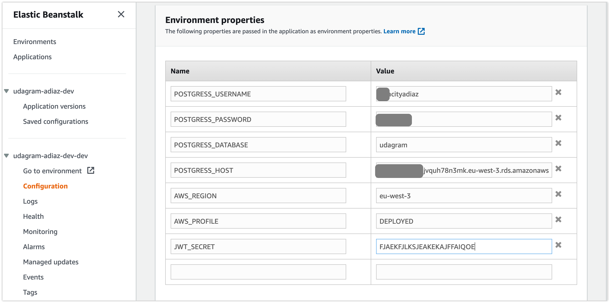  

* Change at package.json required to deploy at Elastic Beanstalk.  
```js
"main": "server.js",
```
---
### Lesson 5: user authentication and security
#### Basic Security and User Auth
* Authentication: Who is asking? 
* Authorization: Can they ask?
* Schema  
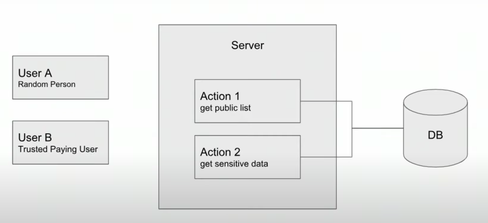  

* Storing and Using Passwords: do not store passwords as plain text.
* Improving our Password Storage
  * Symmetric key  
  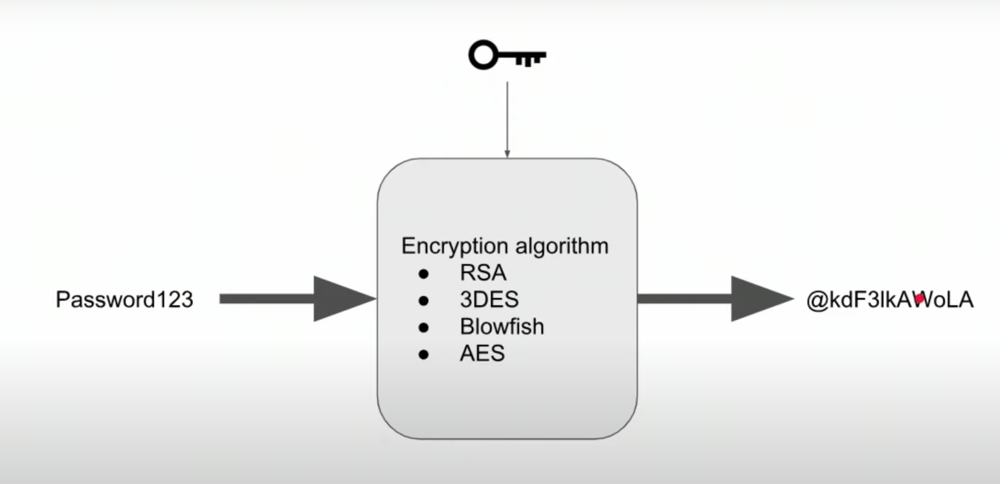 
  
  * One way hash  
  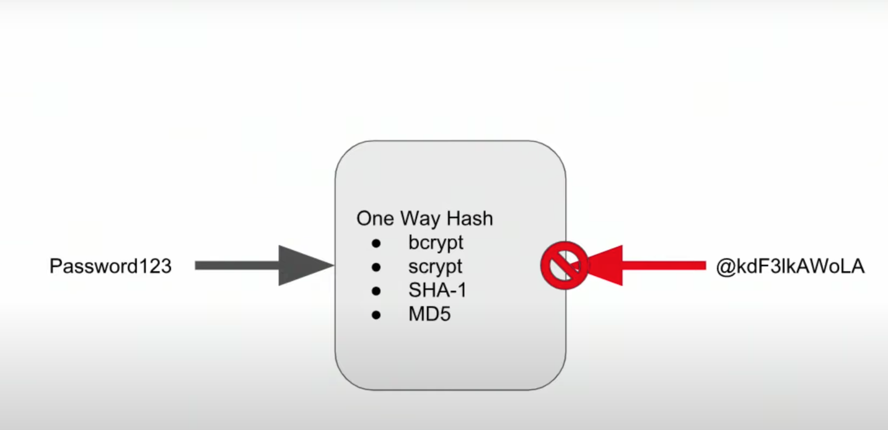 
  
  * Salt    
  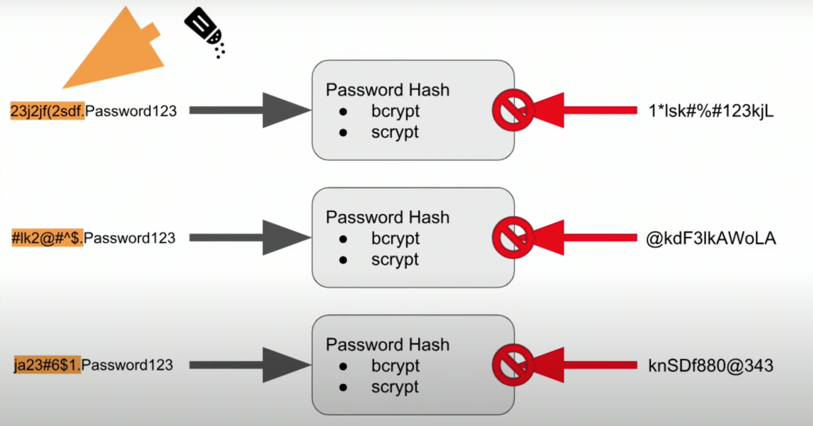 
  
  * Other things to keep in mind:  
    * Don't reuse your salt
    * Keep your salt long
    * Dont't trunst anyone
      * Including yourself. Don't invent your own crypto!
      * Review policies of 3rd pariteis and ask hard questions
      * Secrets are high risk, keep them limited and secure
      * MFA, email verifications, etc.
  * Cognito, service of aws to manage users: https://aws.amazon.com/es/cognito/

#### Tips to Follow Along
* Adding Authentication  
In this lesson, we'll be adding a new feature to our server. Each concept will build on prior steps so make sure you're comfortable before moving forward.

* Git Process  
It may be good practice to branch off your dev branch with a feature branch for f-auth. This way you have an easy way to go back in time to see what you've changed.

* Running the Server  
Don't forget, you can run the server in developer mode by running ```npm run dev``` in the terminal.
---
#### Implementing Salted Hashed Password
* Using bcrypt to salt, hash, and compare  
We'll be using the bcrypt library to perform these functions. Check out the bcrypt docs for some more information: https://www.npmjs.com/package/bcrypt
* Install bcrypt
> npm i bcrypt --save  
npm i --save-dev @types/bcrypt

* __BCrypt Clarification__  
  * __Salt Rounds__: the password is passed through the salted hashing function, and the output is again passed through the hashing function in a loop. The more times we iterate on the hashing function, the more we can guard against brute force attacks that try to guess the password. The salt rounds decide how many times to go through this loop. Settings salt rounds to 10 means we iterate on this hashing function 2^10 times.  

  * __Comparing Passwords__: When you're using the ```bcrypt.compare``` method, it may appear that the salt is ignored. However, if you look closely at the example outputs in the video above, it is clear that the salt is actually prepended to the hash which we are using in the compare method. In other words, when we save the hash in our database - it is storing both the salt and the resulting hash as one value. Then, when comparing the plain text password, the stored salt and hash are split and the salt is used to produce the new hash, which is ultimately what is being compared.

#### bcrypt implementation solution
```js
async function generatePassword(plainTextPassword: string): Promise<string> {
    const saltRounds = 10;
    const salt = await bcrypt.genSalt(saltRounds);
    return await bcrypt.hash(plainTextPassword, salt);
}

async function comparePasswords(plainTextPassword: string, hash: string): Promise<boolean> {
    return await bcrypt.compare(plainTextPassword, hash);
}
```
---
#### Storing Passwords on our Clients
* Sessions, JWTs, and Environment Variables   
  * Our client can be a web browser or another server. In either of these cases, we need to send some authentication information along with each request.

  * On our web browser, this is most commonly performed by storing some kind of credentials in something like the localstorage which allows us to store information for a specific site in a key-value store. JSON Web Tokens are one type of credential that can be stored locally in this fashion.

  * On our servers, we'll usually want to use something like an environment variable. This is a variable which is accessible within that instance and only that instance.

  * The idea is to avoid sending password every request, methods
    * Cockies  
    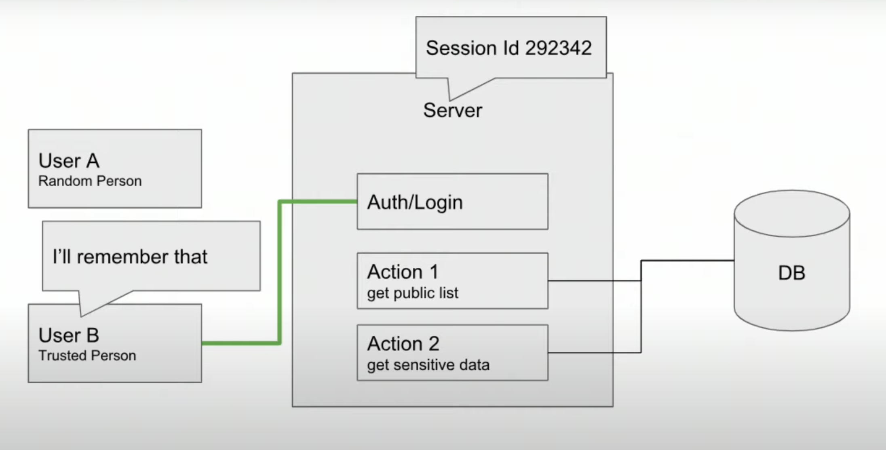 

    * JSON Web Tokens  (JWT), authorization header  
    Visit the site and play with JSON Web Tokens at jwt.io
    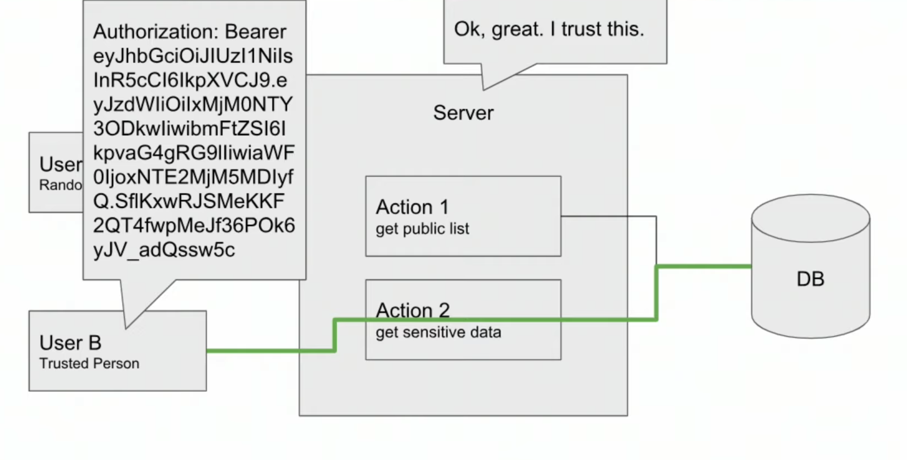

    * Server  
    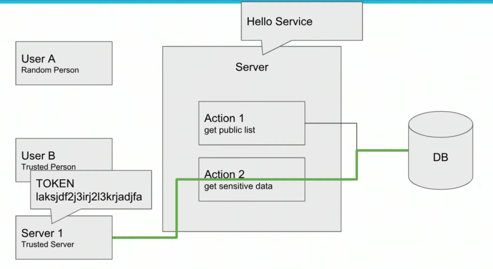 
     
    
---

#### Implementing JWTs in Node
* Steps
  1. Import library  
  ```js
  import * as jwt from 'jsonwebtoken';
  ```
  2. Generate de JWT  
  ```js
  function generateJWT(user: User): string {
      return jwt.sign(user, config.jwt.secret);
  }
  ``` 

  3. Return the JWT on the register user request  
  ```js
  router.post('/', async (req: Request, res: Response) => {
    ....
    res.status(201).send({token: jwt, user: savedUser.short()});
  }
  ```
* Requiring Auth to Restrict Endpoint Usage  
  * In the next video, we'll be calling our requireAuth method to validate the JWT is in the request authorization header. Before continuing, it's recommended you read this [express resource](https://expressjs.com/en/guide/writing-middleware.html) on writing middleware to clarify this concept.

  * Each protected endpoint adds a middleware function ```requireAuth``` which is defined in the ```auth.router.ts``` file.  
  This method will check if the authorization header exists and is a valid JWT. 
    * If yes, it allows the endpoint to continue processing. 
    * If no, it rejects the request and sends appropriate HTTP status codes.
---
#### Deploy Changes
* Integrate Changes in Git  
If you've been following the Git process, create an merge a pull request to integrate your stable feature branch with dev. Keep in mind, if this was a real project, this is when you'd want to make sure your system is passing unit and integration tests, and conduct a peer code review.

* Build from Source  
To create fresh build artifacts to deploy run: ```npm run build```  

If you recall, this will create a new artifact to run on the cloud server at www/Archive.zip.

* Deploy to the Cloud  
Once built, you can deploy changes to the elastic beanstalk instance by running: ```eb deploy```  
This will upload the new code and restart the running instances!
---
#### Closing tips on security
* Examples of Good Security Policies
  * [NPM](https://www.npmjs.com/policies/security)
  * [Nylas](https://www.nylas.com/security/)
  * [AWS](https://aws.amazon.com/security/)
---
#### Lesson Recap
* Some Resources to Stay On Point:
  * [owasp.org Top 10](https://www.owasp.org/index.php/OWASP_Top_Ten_Cheat_Sheet)
  * [npm auditing](https://docs.npmjs.com/auditing-package-dependencies-for-security-vulnerabilities)
  * [github security alerts](https://help.github.com/en/articles/about-security-alerts-for-vulnerable-dependencies)
---
### Lesson 6: scaling and fixing
#### How the Internet Routes: DNS
* AWS Route 53 Developer Guide  
  * Amazon Web Services' flavor of DNS is called Route53. This service allows you to set up routing profiles for your domain names and direct traffic to services inside of and external to AWS.  
  * Amazon provides great documentation on using Route53 in their [developer guide](https://docs.aws.amazon.com/Route53/latest/DeveloperGuide/Welcome.html).  

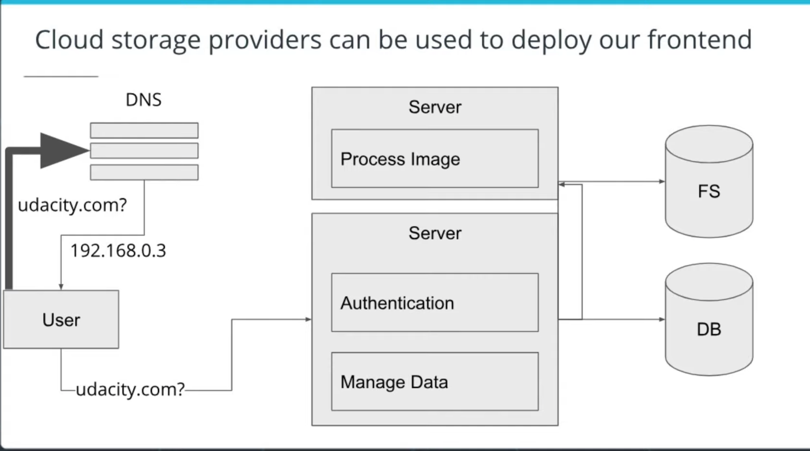

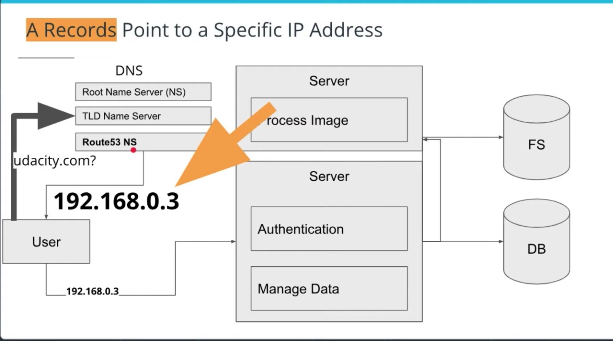

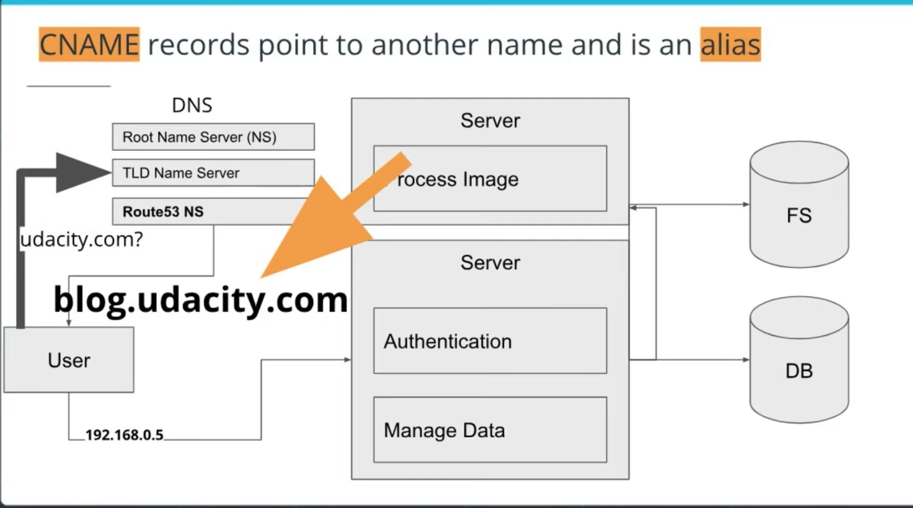

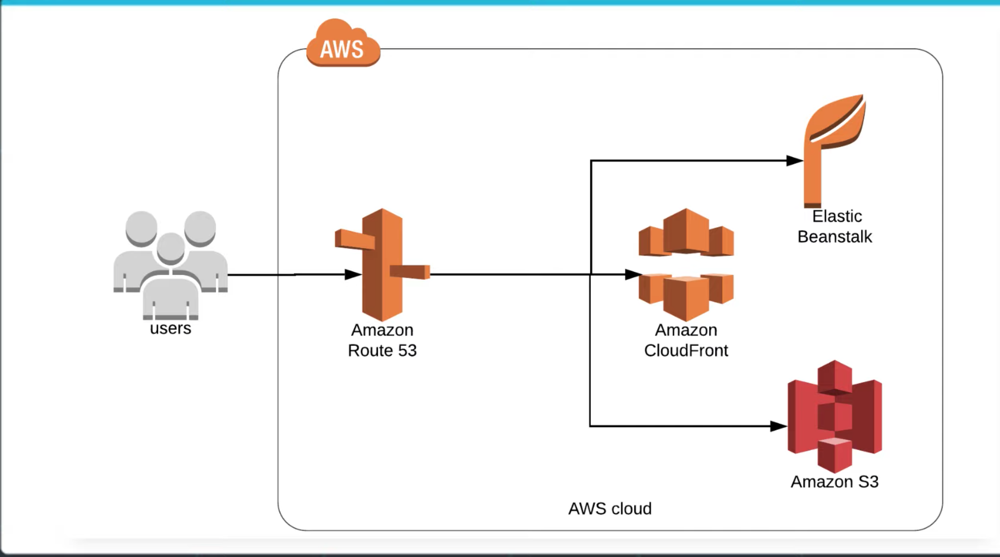

---

#### Frontend Super Basics
* Intro to Frontend JavaScript Frameworks  
  * Frontend frameworks allow us to quickly standup compelling, highly interactive user experiences to interface with our cloud services. 
  * Many frameworks use JavaScript or TypeScript which is another great reason to use Node for our servers - we'll have the same technology requirements throughout our stack!

* Github link to frontend
  * In this lesson, we'll be referencing a prewritten, simple server which uses Node/Express. The github link to clone and follow along is: https://github.com/grutt/udacity-c2-frontend

* Installing project dependencies
  * This project uses NPM to manage software dependencies. NPM Relies on the package.json file located in the root of this repository. 
  * After cloning, open your terminal in the repo directory and run:  
  ```npm install```

  * Running the frontend development server  
    * Before running the frontend development server, you either need to run your backend RestAPI server or have a running RestAPI server running in the cloud. In either case, make sure you set an accessible endpoint as the apiHost variable in ```./src/environments/environments.ts```.
    * To run the developer server and live reload the frontend, open terminal and run:  
    ```ionic serve```

* tip: the ionic-cli must be installed to run ```ionic serve```. Read [the docs](https://ionicframework.com/docs/cli) to make sure this is installed globally.  
```npm i -g ionic```
---
#### Intro to Content Delivery Networks (CDN)

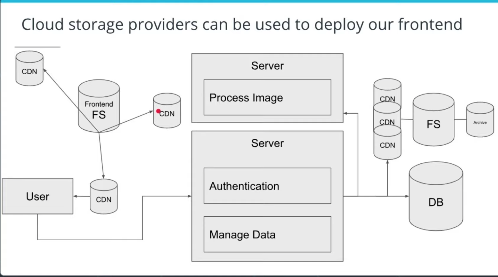  

* Using CDNs to Serve Our Frontend  
Our frontend is loosely coupled and can be served from a separate server than our backend. This allows us to create static build artifacts (pure html/css/javascript files that can be directly used by a browser) that can be served efficiently using content delivery networks.

* Deploying the frontend using AWS S3 and CloudFront  
The static build artifacts in the www/ directory can be uploaded to an S3 bucket which can be linked to a CloudFront distribution.  
This is beyond the scope of required work for this course, but it is a good skill to practice.

* Amazon provides a great resource to configure S3 and CloudFront to accomplish this goal: https://aws.amazon.com/premiumsupport/knowledge-center/cloudfront-serve-static-website/

* Command:  
``` ionic build ```  
``` ionic build --prod```
---
#### Scaling Our System to Handle More Users
* Scaling Up  
Making your instance more powerful - more ram, better CPU, blazing fast GPU!
* Scaling Out  
Adding more server instances and splitting the responsibility.  

  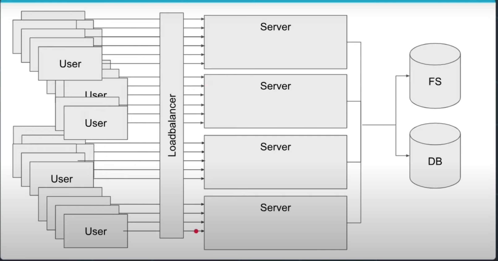  

* AWS Autoscaling Group Autoscaling Triggers  
AWS offers a detailed article on all of the options to scale your elastic beanstalk deployments: https://docs.aws.amazon.com/elasticbeanstalk/latest/dg/environments-cfg-autoscaling-triggers.html
* Bottlenecks - Scaling the Whole System  

* AWS RDS Autoscaling Configuration  
AWS offers a great resource describing scaling of RDS: https://aws.amazon.com/blogs/database/scaling-your-amazon-rds-instance-vertically-and-horizontally/

* Note: AWS uses Vertical Scaling to refer to Scaling Up and Horizontal Scaling to refer to scaling out.

#### Monitoring, Testing, and Debugging After Deployment
* Automatic Bug Reporting  
We discuss [Sentry](https://sentry.io/) to automatically catch errors and provide a stack trace to developers so we can quickly find and fix bugs!

    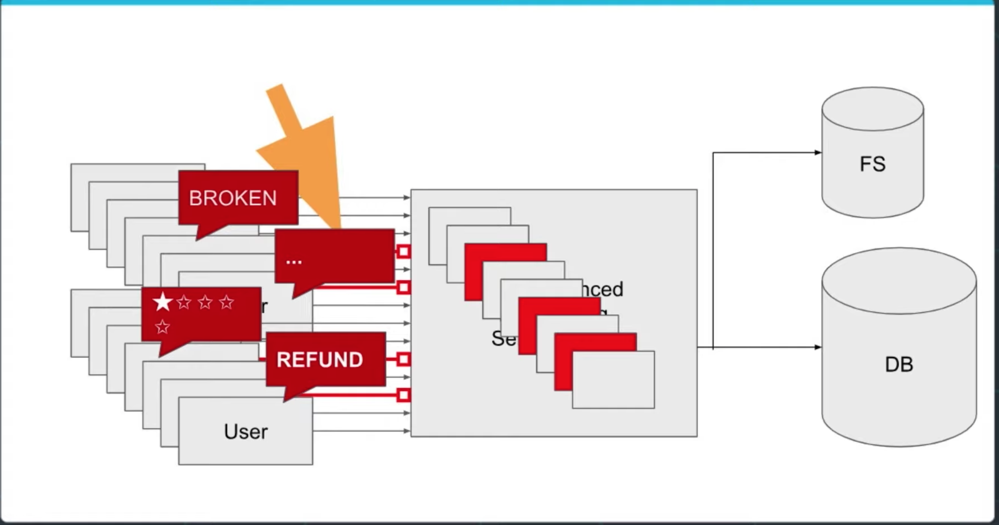  

* Testing Concurrency  
As a cloud developer, you'll often want to test how your cloud will react and perform under high load.  
__Siege__ is a lightweight CLI tool to create a large number of concurrent requests to simulate this kind of situation.  
It's strongly encouraged to read the manual and, if you're up for it, try issuing some siege tests on your local development RestAPI server.
* WARNING! Amazon Web Services isn't really "cool" with load testing or other forms of aggressive testing like penetration testing on their platform.  
Be cautious before running these kinds of tests on AWS infrastructure to prevent your local IP from being blocked or your services being suspended. 

* Monitoring the State of the System
  * We'll introduce:
    * CloudFlare for improved DNS with monitoring and failover capabilities.
    * DataDog for stack performance and health status.
  * AWS also has native tools to help monitor performance called CloudWatch.

---
#### Project Overview
* Starter Code  
The project starter code can be found here: [Image Filter Starter Code](https://github.com/udacity/cloud-developer/tree/master/course-02/project/image-filter-starter-code)

* Getting Started
  1. Setup Node Environment  
    You'll need to create a new node server.  
    Open a new terminal within the project directory and run:
      * Initialize a new project: ```npm i```
      * run the development server with ```npm run dev```
  2. Create a new endpoint in the ```server.ts``` file  
      * The starter code has a task for you to complete an endpoint in ```./src/server.ts``` which uses query parameter to download an image from a public URL, filter the image, and return the result.  
      * We've included a few helper functions to handle some of these concepts and we're importing it for you at the top of the ```./src/server.ts``` file.  
      ```import {filterImageFromURL, deleteLocalFiles} from './util/util';```
  3. Deploying your system  
    Follow the process described in the course to ```eb init``` a new application and ```eb create``` a new environment to deploy your image-filter service!  
    Don't forget you can use ```eb deploy``` to push changes.

  4. Submit your project, the project submission should include:
      * a Git repository
      * a screenshot of the elastic beanstalk application dashboard after deployement
      * a link to the endpoint URL for a running elastic beanstalk deployment either in the Project README or in the project submission notes.

Before submitting, check if you have completed all criteria in the project [rubric](https://review.udacity.com/#!/rubrics/2555/view).

---
## Monolith to Microservices at Scale
### Introduction to Microservices
* Deploying Code is Not Easy  
Deploying changes in code is non-trivial. We have to consider the impact of potential bugs, downtime, ease of deployment, and downstream effects to consumers of the application.

#### Business Value
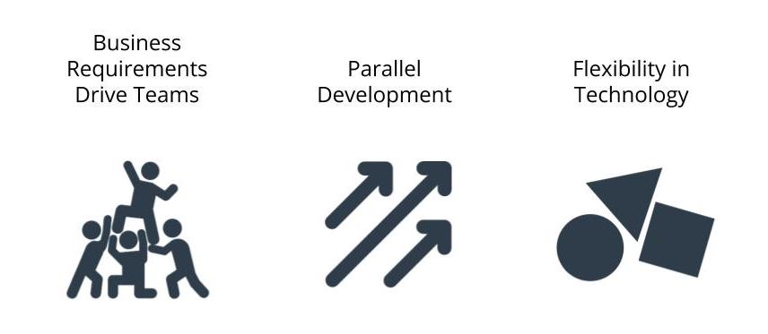  

* Business Requirements Drive Teams  
Teams can be organized around business needs and have a clearer focus on customer requirements. There is clear ownership on who owns what.

* Teams Can Work in Parallel  
Since projects are deployed independently, teams can develop and deploy code without stepping on each others' toes.

* Flexibility in Technology  
We are not limited to a certain technology and can choose what may work best for the business need or team.

#### When Not to Use Microservices
* Monoliths Are Not Bad!
  * Microservices designs are another architectural pattern and are not intended to replace monolith applications. We should not blindly build applications as microservices without understanding the tradeoffs. Doing so could actually decrease productivity!
  * One way to think about this is to revisit our analogy with the Sports Superstore. Does it make sense for every aspiring small business owner to open and manage multiple stores at once?
* Considerations for Not Using Microservices
  * System Complexity  
    Rather than deploying a single application, we would be deploying multiple modules separately. There is more overhead in setting up projects.
  * Network Latency  
    By introducing a network between modules, we have increased latency in application performance and will find it harder to debug our application.
  * Difficulty with Debugging  
    We can no longer rely on a stack trace or tools that can help us pinpoint where a bug is. We may end up relying on logging to find causes of issues.

#### Software Delivery History
* Release Cycles  
Software was often released a few times a year with large deployments. Now, containers and deployment strategies have made it possible to deploy multiple times a day with no downtime.  
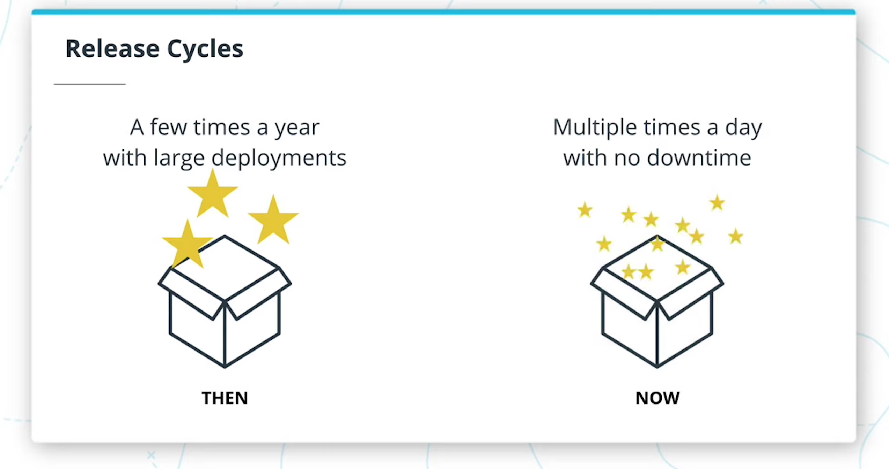  

* Team Structure  
Teams were organized around technologies rather than business requirements.  
Teams may have previously consisted of separate teams for Quality Assurance, Database Administrators, and Designers. Now, we may have multi-skilled teams grouped together where all of these roles can be found in a single team.  
    

* Hardware  
Software was deployed to expensive mainframe computers located in data centers. Now, commodity hardware is powerful enough to run our applications. Distributed computing can help us perform large-scale data processing without the need to purchase dedicated, expensive hardware.  
  

#### Course Outline

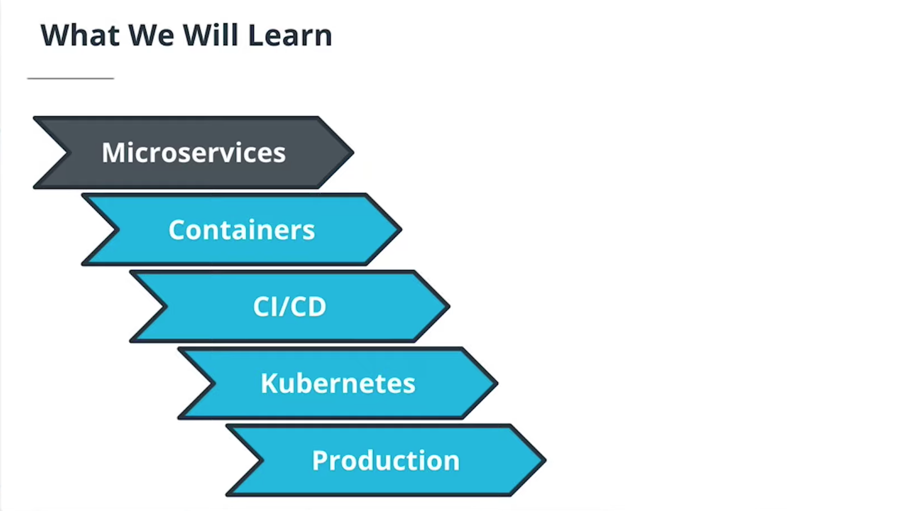  

* Microservices Design Principles and Best Practices
  * Explain different microservices architecture designs
  * Divide an application into microservices
* Containers using Docker
  * Build and run a container image using Docker
  * Debug a container
  * Store these images using a container registry
* Independent Releases and Deployments
  * Understand CI/CD benefits
  * Use Travis to build a CI/CD pipeline
  * Integrate GitHub and CI/CD and automate testing with CI
  * Understand alternatives to Travis CI including Jenkins
* Service Orchestration with Kubernetes
  * Understand the fundamentals of Kubernetes
  * Configure and launch an auto-scaling, self-healing Kubernetes cluster
  * Deploy microservices using a Kubernetes cluster
  * Understand alternative deployment strategies including ECS and Fargate
* Securing and Tuning Kubernetes Services for Production
  * Use a reverse proxy to direct requests to the appropriate backend
  * Securing the microservices
  * Configure scaling and self-healing for each service
  * Understand the differences between internal and external traffic
* Debugging, Monitoring, and Logging
  * Use best practices for logging with microservices
  * Use logs to capture metrics for debugging
  * Implement monitoring and logging for microservices deployment
  * Improve resilience and availability into cloud applications

#### Tools
__Tools We Will Be Using__  
Please create an account for each of these services:
* [AWS](https://aws.amazon.com/)
* [Travis CI](https://travis-ci.com/)
* [GitHub]()
* [DockerHub](https://hub.docker.com/)

__Software Requirements__
Please install these so you can run them on the command line:
* [npm](https://www.npmjs.com/get-npm)
* [Docker](https://docs.docker.com/get-docker/)
* [git](https://git-scm.com/book/en/v2/Getting-Started-Installing-Git)

### Microservices Design Principles and Best Practices
#### Monolith vs Microservices
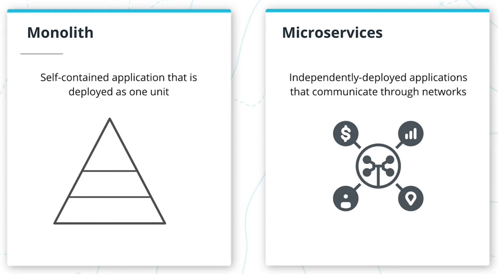  
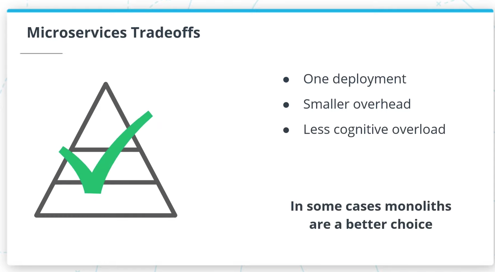  

* Microservices are an architectural style where an application is composed of modules that can be independently developed and deployed.
* In monoliths, all the components of the application are built into a single application.

__Microservice Benefits__  
* Scale  
Lean applications that are able to tailor their logic and infrastructure to their specific business needs. More-easily architected for horizontally-scaling.
* Development in Parallel  
Teams can develop and deploy their own codebases.
* Cost Effectiveness  
Utilize resources only for what is necessary for the specific microservice.
* Flexibility  
Choose technologies that make the most sense for the team and business.

#### Solution: monolith vs microservices
* Any application that can be built as a monolith can be built as a microservice. 
* It’s up to you to weigh out the benefits of choosing one over the other.  
* Oftentimes, microservices are harder to manage and take more investment to initially set up  

  
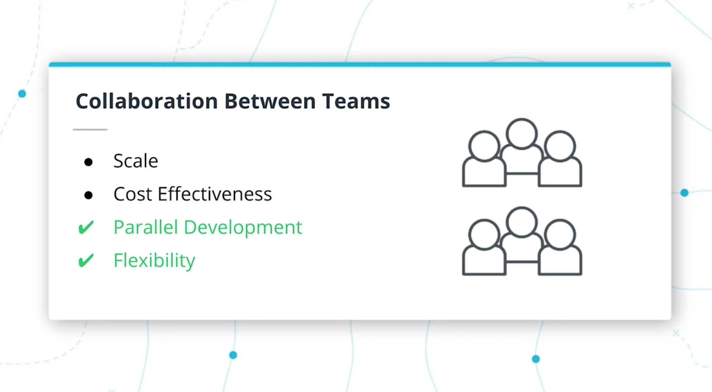  
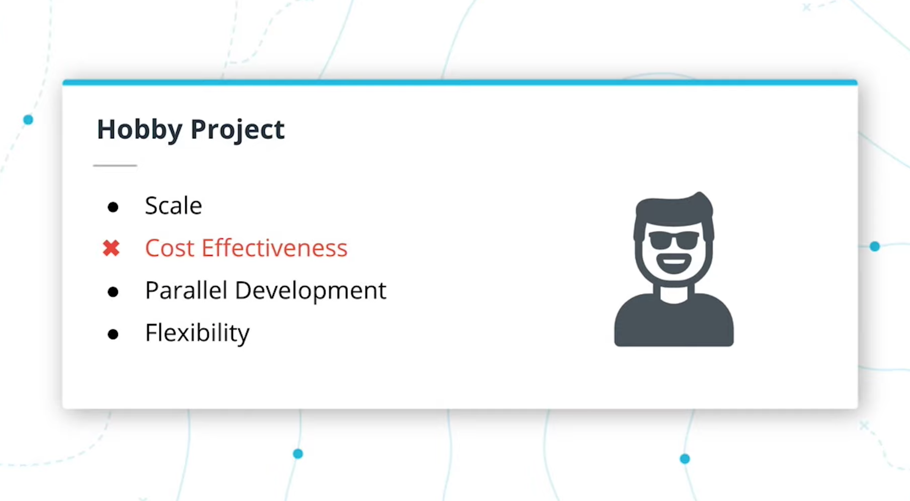  
  
  
---
#### Microservice Architecture Designs
Technical Properties
* Communication --> REST
  * Services communicate through a network
  * REST is currently the most-commonly used network interface
* Independently Deployed
  * Deployment to one service should not affect another
* Fault Tolerant
  * Diligence in writing code that can anticipate when another microservice isn’t working

* Alternatives to REST  
While REST is the most popular form of network communication used for microservices, there are many other protocols that can be used.  
The following are some other ways microservices can communicate with one another:
  * Publish-Subscribe
  * Queues
  * gRPC
  * SOAP
  * GraphQL
* Other
The following has some more context on microservices in greater detail.
More on Microservices: https://martinfowler.com/articles/microservices.html
---

#### Solution Microservice Architecture  
  
  
---

#### Divide a Monolith Application Into Microservices
* Map Your Dependencies
  * It's important to understand the application you're working with before breaking it apart.
  * One strategy is to map out the modules and their dependencies as a directed graph to understand the downstream impact of your changes.
* Where to Start?
  * There’s no hard rule: choose the part of the application that makes the most sense to you.
  * Dependency graph serves merely as a guideline on risk based on the number of dependencies.
  * A module with the least dependencies will potentially have the downstream effects meaning less risk.
* How to Start?
  * The Strangler pattern is a common and effective way to migrate legacy applications.
  * Rather than replacing your code with a new version, you can gradually replace components of your application.
* Shared Code
  * Code duplication can be abstracted into common libraries used across projects.

* Further Reading  
We went over some strategies and techniques on a high level. Here are some additional resources if you would like to learn more about these topics.
  * [The Strangler Pattern](https://docs.microsoft.com/en-us/azure/architecture/patterns/strangler)
  * [Dependency Graph](https://en.wikipedia.org/wiki/Dependency_graph)
---
### Containers Using Docker

### Authomating the Application Development Lifecycle

### Orchestration with Kubernates

### Best Practices/Design Patterns for Kubernetes in Production
### Refactor Monolith to Microservices and Deploy

## Develop & Deploy Serverless App

## Capstone


